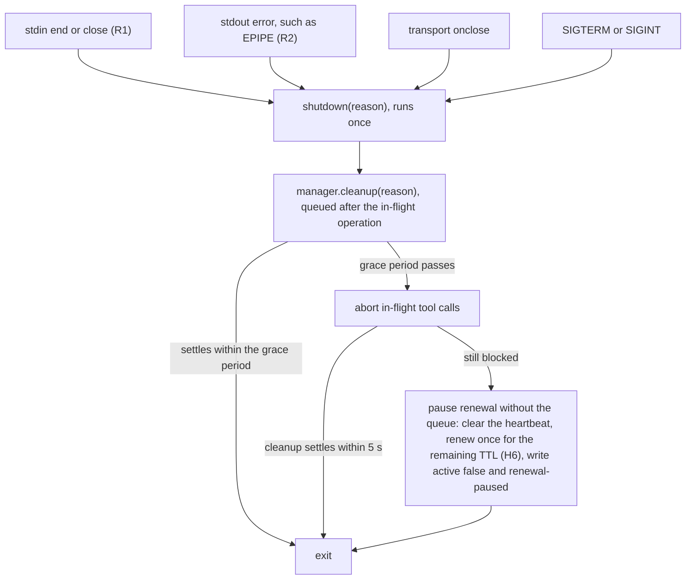

# Lifecycle fixes: session end, cancellation and finish

| Item | Value |
|---|---|
| Document type | Decision record and design note |
| Scope | How the MCP server ends a session, and how `acquire`, `finish` and `release` behave at the edges of the lease lifecycle |
| Base | Published 0.6.1 source (`bec0ba4`) |
| Status | Decisions R1–R6, R8 (owner decision PS-D12) and H6 are implemented with reproducer tests. R7 has a reproducer test only and waits for the owner's decision. |
| Authority | [Technical design, Section 5](technical-design.md#5-lease-lifecycle-persistence-and-recovery) remains the lifecycle contract. This note records the corrections made to meet it and the two points where it changes it. |

## Context

- The README promises that when the server's stdio closes, renewal pauses, the recording detaches and the VM is retained.
- Version 0.6.1 did not keep that promise in two ways, and both left leases renewed or marked active after the client was gone.
- The first failure is that the MCP SDK's `StdioServerTransport` listens only for `data` and `error` on standard input, so end of file (EOF) on standard input never reached the server's shutdown path.
- After any tool call that took the owner lock, the Python lock helper kept the Node.js event loop alive, so the process stayed alive after its client exited and kept renewing an owned lease every 60 seconds.
- The second failure is that the SDK writes responses to standard output without an error handler, so a response written after the client exited raised an unhandled `EPIPE` error and ended the process before cleanup.
- In that case `lease.json` kept `active: true` and no `renewal-paused` event was written.
- Several smaller lifecycle gaps were found at the same time; they are listed as R3 to R8 below.

## Decisions

| ID | Failure | Decision |
|---|---|---|
| R1 | The server never notices EOF on standard input. | Treat `end` or `close` on standard input as the end of the session, through the same shutdown path as SIGTERM and the transport's `onclose`. |
| R2 | A write to a closed standard output ends the process without cleanup. | Handle `error` on standard output and route it to the same orderly shutdown. |
| R1, R2 | Shutdown must not cut short an in-flight `finish` or `release`. | Shutdown waits for the in-flight operation for a bounded grace period (default 120 seconds, `MCP_VM_RELAY_SHUTDOWN_GRACE_MS`). After the grace period it cancels in-flight tool calls, and if they still do not settle it pauses renewal directly and exits. |
| R3 | `relay_release` on a session that owns no lease looks like a successful release. | The result says explicitly that this session owns no lease and nothing was released, and it is an MCP error result. The relay never guesses at another session's lease. |
| R3 (identity) | A restarted server gets a new random session identity, so it cannot see its earlier lease. | No change. Changing the default session identity is the owner's decision; a skipped reproducer documents the current behavior. |
| R4 | A cancelled `relay_acquire` whose lease arrives after cancellation keeps the VM with no heartbeat and no owner action. | Keep the lease, start its heartbeat, and report in the error that the VM is retained and renewed under this session until `relay_finish` or `relay_release`. |
| R5 | `relay_finish` stops at the first declared extraction that fails, so every retry fails the same way. | A declared output whose source does not exist in the guest is recorded as an `extraction-incomplete` event, reported in the result as `incompleteExtractions`, and packaging continues. A transfer or checksum failure still fails `finish` and keeps the VM. |
| R6 | `release` and shutdown wait behind a guest command that cannot be cancelled. | Pass the tool call's abort signal through to the vm-service `exec` request for diagnostic commands and for the receiver dispatch, so a cancelled command stops waiting and the next queued operation can run. |
| R7 | A failed `finish` keeps the VM. | No change; this is documented behavior. The owner decides whether a failed delivery should release. A skipped reproducer documents the current behavior. |
| R8 | The relay state grows about 14 MiB per recorded step, and `finish` fails once the state passes 512 MiB or 10,000 files. | Resolved by owner decision PS-D12 (below): relay evidence has no size limit, so the 512 MiB / 10,000-file bound on delivering the relay state is removed. |
| H6 | The relay acquires and renews each lease for its whole `ttlHours`, so a client that crashes leaves its VM leased for up to that whole TTL. | The relay tracks the lease's own deadline (`startedAt + ttlHours`) and renews vm-service in short windows (default 15 minutes), never past the deadline, and not at all at its end. A graceful pause sends one final renewal for the remaining TTL, so a paused VM is still retained until its TTL. Settled with the design reviewer. |

### Owner decision PS-D12: relay evidence has no size limit

| Item | Value |
|---|---|
| Decision | PS-D12, recorded in pi-secretary's decision records on 2026-09-27 |
| Decided by | The owner; this decision is fixed and is not reopened here |
| Resolves | R8 |

- Relay evidence has no size limit.
- Screenshots are not scaled, compressed, deduplicated or budgeted; every captured original is delivered as captured.
- The 512 MiB / 10,000-file bound on delivering the relay state (`src/transfer.ts`) is removed. The owner never designed that bound.
- The bound on what a client stages into the guest (512 MiB and 10,000 files per staging request) is not evidence and stays.
- The 64 MiB limit on a single image original stays, because it is a validity check on one image, not a budget for the evidence.
- The protections the bound gave the host are replaced by measures that do not limit evidence; they are described in the design below.

## Design

### Session end

The server has one shutdown function, and every session-end signal calls it once.

- Shutdown does not close the MCP transport first, because the SDK aborts every in-flight request handler when the transport closes, and that would cut short a `finish` or `release` that the client had already sent.
- Each tool call's signal is combined with a server-wide shutdown signal, so the server can cancel in-flight calls after the grace period.
- `cleanup` is serialized behind the in-flight operation, so a `finish` or `release` in flight completes before renewal is paused.
- After a completed `release` or `finish` there is no lease left to pause, so `cleanup` only releases the owner lock.
- The direct pause after the grace period does not wait for the operation queue; it clears the heartbeat timer, renews the lease once for its remaining TTL (H6, bounded by a 10-second request timeout), writes `active: false` to `lease.json` and logs `renewal-paused`, and the process then exits.
- The owner lock helper exits when the parent's pipe closes, so the lock is released with the process.
- Errors on standard output after the first one are absorbed by the same handler, so repeated failed writes cannot raise an unhandled error.

### Explicit results for no-lease release and cancelled acquire

- A `release` on a session that owns no lease returns `{"active": false, "ownedLease": false, "released": false, "diagnostic": "..."}` with `isError: true`.
- The diagnostic names the session identity rule: a lease acquired by an earlier server process under another session identity is visible only when `MCP_VM_RELAY_SESSION` names that identity; otherwise the backend's TTL expires it.
- A successful release still returns the owned status, which is `{"active": false}` once the VM is gone.
- A cancelled `acquire` whose lease arrives after cancellation is still an error result, because the caller did not receive the acquisition it asked for.
- That error says that the VM is retained and renewed, names the VM, and tells the agent to call `relay_finish` or `relay_release`.
- The technical design states that user cancellation of a command is not a request to release the VM, and an existing test asserts that the returned identity is retained until an explicit release. The fix therefore keeps the lease and starts renewal rather than releasing it.

### Finish with a declared output that was never produced

- `finish` pulls each declared output separately.
- When the guest reports that the output's source path, or one of its parent directories, does not exist (`ENOENT`), the output was never produced, and a retry would fail the same way.
- In that case `finish` logs an `extraction-incomplete` event with the name, the path and the error, adds the output to `incompleteExtractions` in the result, and continues with packaging, verification and release.
- Any other extraction failure, such as a transfer failure or a checksum mismatch, still fails `finish` and keeps the VM, because the guest may hold the only good copy and the agent can repair and retry.
- The opt-in full workspace is still extracted strictly, because the workspace always exists after staging.
- `release` keeps its existing behavior of tolerating every extraction failure.
- The request for this item asked for every failed extraction to be tolerated, as `release` does. The existing test "finish verification failure retains the VM until output is repaired" and technical design Section 5.1 require a verification failure to keep the VM, so only the never-produced case changed. The owner can widen it later.
- This changes one sentence of technical design Section 5.1, and it replaces the "missing" case of the existing test "finish missing failure retains the VM until output is repaired" with the R5 reproducer.

### Cancellable guest commands

- The diagnostic `exec` path and `VmTransport.send` pass the caller's abort signal to vm-service's `exec` request.
- A cancelled request stops waiting for the HTTP response; it does not stop the guest process, and the result is reported as `uncertain`, which keeps the VM and is never replayed.
- The receiver's receipt for a cancelled dispatch records the outcome as uncertain, as for any other lost response.
- Because the guest command keeps running, an operation submitted right after a cancellation can meet the receiver lock of the cancelled one and be reported as uncertain. It is never replayed, and the VM is kept.
- The existing test "abort during a dispatched operation retains its receipt and VM without replay" now waits for the cancelled guest command to finish before it submits the next run.

### Relay state of any size

- The guest inventory walks the relay state without a total-size or file-count bound, and it hashes each file in chunks, so a single file larger than one Node.js read (2 GiB) is inventoried too.
- The host inventory and the single-file pull check hash in chunks for the same reason.
- The inventory frame, the list of file facts, has no count limit; it still travels as a hashed file and never on the `exec` output.
- `pushFile` and `pushTree` keep the 512 MiB and 10,000-file bound, because that bound limits what a client stages into the guest, not the evidence.
- The 64 MiB check on one image original (`src/transfer.ts`, `src/images.ts`, `src/guest/receiver.ts`) is unchanged.

### What replaces the bound's protection

- Finalization pulls the relay state into `<package>.finalization-attempts/<uuid>/state` and then refreshes the package's `state/` from it.
- The refresh moves the verified incoming tree into place with one rename, so the host holds the state once rather than twice. The rename is atomic: the state is either wholly moved or not moved.
- When the incoming tree is on another volume than the package (`EXDEV`), the refresh falls back to copying it and keeps the incoming tree, as before.
- Previous state is still archived under `<package>.finalization-attempts/previous/`, and snapshots missing from the incoming state are still retained by copying them from that archive.
- The delivered `state/` directories keep the private mode (0700) that the pull gives them.
- Before any byte of the relay state is pulled, for `finish`, for a `release` that packages, and for a recording reset, the relay compares the total bytes of the guest's state inventory with the free space of the evidence volume (`statfs` on the package directory).
- When the state does not fit, the operation fails before the pull with a diagnostic that names the bytes needed, the bytes free and the shortfall. This is a precondition, not a limit: `finish` keeps the VM, so the agent can free space and call `relay_finish` again. A `release` still releases, as it does for any delivery failure, and records the diagnostic in `<package>.delivery-error.json`.
- The guest scan hashes every byte of what it inventories, so its timeout is no longer a fixed 120 seconds. It is 120 seconds plus 125 ms per MiB (8 MiB/s of hashing). A stat-only walk sizes the tree first; a staged file's known size and the inventory taken before a pull size the scans that follow them without that walk.

### Lease renewal in short windows (H6)

- The lease's deadline is `startedAt + ttlHours`, computed from `lease.json`, so a restarted server keeps the same deadline.
- `acquire` asks vm-service for the renewal window, or for the whole TTL when that is shorter. `ManagerOptions.renewalWindowMs` sets the window; the default is 15 minutes.
- Each heartbeat renews the lesser of the window and the time left until the deadline, so no renewal reaches past it. The heartbeat interval is at most a third of the window (60 seconds by default).
- vm-service refuses a `ttl_hours` below 0.1 hours. With less than 6 minutes left, the renewal before already ends at the deadline, so the relay stops renewing, sets `active: false` and logs `renewal-stopped`. It never releases the VM for this.
- A graceful pause (`cleanup` for every session end, `settle`, and the last-resort `pauseNow` after the shutdown grace period) first lets an in-flight renewal land, then sends one renewal for the remaining TTL, records the confirmed expiry and logs `renewal-paused`. A failed final renewal is logged as `final-renewal-failed` and does not stop the pause.
- The effect is that a client that crashes without a graceful pause leaves its VM leased for at most one window, plus the backend grace period, instead of the whole TTL. The README promise that a paused VM is retained until its TTL for an explicit finish or release still holds.

## Verification

- Each item R1 to R6 has a reproducer test that was committed on its own and failed on the unfixed source for the stated reason, followed by a separate fix commit.
- The server tests start the built `dist/server.mjs` against an in-process fake vm-service or a closed port, with a temporary state directory, registry, project and home directory, and a fake `tart` script.
- The tests never use a real VM, the live vm-service, the real Tart or `vmctl`.
- The reproducers for R3 (session identity) and R7 are marked `todo` with the note "waiting for the owner's decision", and they assert the current behavior.
- The R8 reproducer was a `todo` test until owner decision PS-D12; it now asserts the decision and failed on the source before the bound was removed.
- The R7 reproducer makes packaging fail with an injected corrupt pull of a state file, because an oversized state no longer fails.

| Item | Test file | Test |
|---|---|---|
| R1 | `tests/lifecycle.test.ts` | "R1: the server exits when its client closes stdin after a call that took the owner lock" |
| R1 | `tests/lifecycle.test.ts` | "R1: closing stdin with an owned lease pauses renewal, retains the VM and exits" |
| R1 | `tests/lifecycle.test.ts` | "R1: closing stdin during an in-flight release lets the release complete before exit" |
| R1 | `tests/lifecycle.test.ts` | "R1: shutdown behind an operation that never settles is bounded by the grace period and still pauses renewal" (added with the fix) |
| R2 | `tests/lifecycle.test.ts` | "R2: a response written after the client closed its reader ends the session with cleanup, not an unhandled EPIPE" |
| R3 | `tests/lifecycle.test.ts` | "R3: relay_release on a session that owns no lease says so instead of looking like a release" |
| R3 (todo) | `tests/lifecycle.test.ts` | "R3 (session identity): a restarted server with the default random session identity cannot see the lease of the process before it" |
| R4 | `tests/manager.test.ts` | "R4: a lease that arrives after the caller cancelled relay_acquire is renewed and reported, not left without a heartbeat" |
| R5 | `tests/manager.test.ts` | "R5: finish records a declared output that was never produced as incomplete and still delivers and releases" |
| R6 | `tests/manager.test.ts` | "R6: release does not wait behind a cancelled diagnostic command whose guest answer never comes" |
| R6 | `tests/manager.test.ts` | "R6: release does not wait behind a cancelled recorded run whose receiver answer never comes" |
| R7 (todo) | `tests/manager.test.ts` | "R7 (owner decision): a finish whose packaging fails keeps the VM and does not release it" |
| R8 | `tests/transfer.test.ts` | "R8 (PS-D12): relay state of about 14 MiB per recorded step scans and pulls past 512 MiB at step 37" |
| R8 | `tests/transfer.test.ts` | "file framing scans more than 10000 files: delivering relay evidence has no file-count bound (PS-D12)" |
| R8 | `tests/transfer.test.ts` | "remote inventory scans a file over 512 MiB, and over one Node.js read, without carrying its bytes; it rejects special files" |
| PS-D12 host disk | `tests/manager.test.ts` | "finish keeps one host copy of the relay state: the pulled state is moved into the package, not copied" |
| PS-D12 host disk | `tests/evidence-merge.test.ts` | "refresh moves incoming into state on the same volume instead of copying it, so the state is not stored twice" |
| PS-D12 host disk | `tests/evidence-merge.test.ts` | "refresh falls back to copying when incoming is on another volume, and keeps incoming" |
| PS-D12 free space | `tests/manager.test.ts` | "finish fails before pulling the relay state when the evidence volume has too little free space, names the shortfall and keeps the VM" |
| PS-D12 scan timeout | `tests/transfer.test.ts` | "the guest scan timeout grows with the bytes it hashes instead of a fixed 120 s" |
| H6 | `tests/manager.test.ts` | "H6: acquire and each heartbeat ask vm-service for a 15-minute window, not the lease's whole TTL" |
| H6 | `tests/manager.test.ts` | "H6: renewal never reaches past the lease's own deadline and stops at its end" |
| H6 | `tests/manager.test.ts` | "H6: a graceful pause (cleanup) sends one final renewal for the lease's remaining TTL" |
| H6 | `tests/manager.test.ts` | "H6: a graceful pause (settle) sends one final renewal for the lease's remaining TTL" |
| H6 | `tests/lifecycle.test.ts` | "H6: closing stdin sends one final renewal for the lease's remaining TTL, after renewing only a short window" |

- Run the suite with `npm run check`, which builds `dist/`, type-checks and runs `npm test`.
- The end-to-end suite with headless Claude Code (`npm run test:e2e`) was not run for these fixes.
