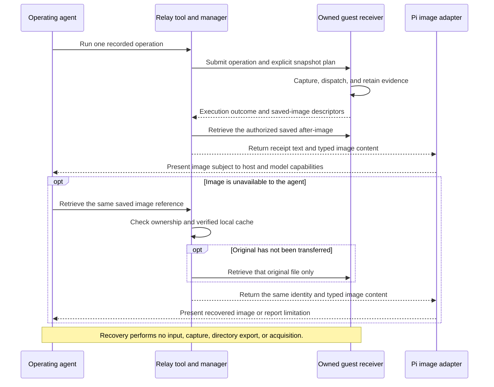

# Design: Screenshot delivery independent of archive extraction

## 1. Status and scope

- The user approved implementation after the original documentation proposal on 2026-09-21. This document now describes the implemented and automated-tested worktree contract, not a deployed or live-accepted capability.
- At the time of this design the relay was one tool with thirteen actions: `search`, `probe`, `acquire`, `stage`, `run`, `image`, `extract`, `finish`, `release`, `acquisition-capabilities`, `console-resolve`, `console-open`, and `console-cancel`. Each action is now its own `relay_*` MCP tool (the `image` action described here is `relay_image`); the selectors and limits below are unchanged by that split. The installed plugin and consumer integrations were not modified; an existing installed session must not be assumed to expose this revision.
- This document owns the screenshot-delivery contract. The [investigation and implementation plan](../.plans/2026-09-21-screenshot-delivery.md) retains the diagnosis, source provenance, original proposal, and pending work. The [verification report](verification.md#screenshot-delivery-investigation-2026-09-21) records measured evidence separately.
- Relay owns display-image delivery, authorized single-image retrieval, identity, transfer, and failure recovery. Application integration remains outside this design's implementation scope.
- Human live viewing is a separate capability. A viewer window cannot replace an image delivered to the operating agent, and neither capability implies human review.

## 2. Historical diagnosis and problem

- At baseline revision `e077367427e6a46a39039434725881c21a979e3e`, the receiver saved display images, but the execution transport pulled only the JSON receipt and the tool returned text-only results. This is the original diagnosis, not the current worktree behavior.
- The current `extract` action retrieves declared files or entire declared directories. It neither selects a member of a declared directory nor returns typed image content.
- The baseline supported inspecting host-local images with an image-capable `read` tool and extracting individually declared application screenshots. Neither facility supplied the owner-scoped saved-image retrieval added by this worktree.
- Copying display images into application output violates the separation between Relay evidence and declared consumer artifacts. Repeated directory exports also create unnecessary copies of an accumulated run.
- Delivering a captured black image does not establish that the intended application was visible. Capture correctness, byte transfer, presentation, agent inspection, and human review require separate evidence.

## 3. Agent interaction

- A normal `run` result includes its saved after-image whenever the snapshot plan captures that phase. The agent inspects that image before selecting further exploratory input when its application requires visual observation.
- A standalone event and a text group's last event can produce an after-image. A first or intermediate group event does not invent an after-image. Diagnostic execution remains explicitly without screenshot evidence.
- Before-images remain retrievable for diagnosis. Default command results attach only the captured after-image to keep results bounded.
- If inline delivery fails, the agent retrieves the same saved image. Recovery never repeats an input event, creates another capture, exports the consumer directory, or allocates another VM.
- An application screenshot is retrieved separately when the application requires inspection of that exact artifact. It never substitutes silently for a Relay display image.



## 4. Command-result contract

- New receiver responses describe actual saved captures without rewriting original journals or capture bytes. Relay correlates each descriptor against its submitted request and authoritative recorded evidence before accepting it.
- Each display descriptor identifies the owned enclosure, recording `sessionId`, `executionId`, `actionId`, `stepId`, `phase`, `capturedAt`, and optional `groupId`.
- Each image descriptor includes an opaque `imageId`, original `sha256`, `bytes`, and `mimeType`. It includes dimensions when decoded and an authorized host-local original path after materialization.
- The result carries the image identity in visible text and structured details. Identity and recovery information remain outside truncatable command output.
- The image appears in the final returned `content` array using Pi's typed image block. A progress update, metadata object, filesystem path, or base64 string in text is not sufficient.

```ts
{
  content: [
    { type: "text", text: "<execution outcome and image identity>" },
    { type: "image", data: "<base64 bytes>", mimeType: "image/png" }
  ],
  details: {
    kind: "relay-image-result-v1",
    isError: false, // True for execution or image-delivery failure.
    result: { /* execution outcome */ },
    imageDelivery: { /* status, image identity, and presentation metadata */ }
  }
}
```

- Execution and image delivery remain independent outcomes. A completed command can have failed image delivery. Recovering an image does not turn an uncertain or failed command into a successful command.
- Pi turns thrown execution errors into text-only results. For image-bearing failures, Relay returns the structured result and uses a narrowly scoped `tool_result` handler to set `isError` while preserving content. Returning an arbitrary `isError` field from `execute` is not a supported substitute.
- Invalid requests are rejected before effects. Real Pi SDK 0.85.1 tests verify that final text, images, and native error flags survive the extension hook, execution events, session persistence, and next-turn context. Legacy failed results without `imageDelivery` retain their throwing behavior.

## 5. Implemented single-image retrieval tool

- Verified single-file materialization uses the existing controlled transfer channel with image-specific integrity, size, deadline, and retry checks. It introduces no unrestricted guest-read endpoint or new backend communication channel.
- The closed `relay_image` tool retrieves one saved image. `relay_extract` remains dedicated to declared archive delivery rather than image presentation.
- The tool rejects `reason` because it performs no recorded input. It selects exactly one target through the following closed branches. Replace illustrative identifiers with actual returned identities; reference IDs are `image-` followed by 64 lowercase hexadecimal digits.

### 5.1 Display selection

```json
relay_image {"target":{"source":"display","sessionId":"<recording-session>","executionId":"<saved-execution>","phase":"after"}}
```

- The required phase is `before` or `after`. The selector resolves recorded captures belonging to the owned enclosure and accepts no guest path, VM name, backend URL, or caller-supplied owner identity.
- A selector for a phase that was not requested returns `not-requested`. It never returns the most recent image instead.

### 5.2 Application selection

```json
relay_image {"target":{"source":"application","name":"<declared-extraction>","path":"shots/0000-initial.png"}}
```

- The name must match an acquisition-time extraction declaration. A directory declaration requires a nonempty relative path to one regular image file. A file declaration omits `path`.
- Selecting a member of a declared directory does not export its siblings. `fullWorkspace` does not grant an implicit image declaration in this initial design.
- The first verified selection fixes the original hash and creates an image reference. The descriptor identifies the declaration, relative path, and retrieval time. Application-supplied capture metadata is not treated as a Relay display association.

### 5.3 Reference recovery

```json
relay_image {"target":{"source":"reference","imageId":"<returned-image-reference>"}}
```

- A reference resolves to the same original bytes or an explicit integrity or availability failure. It cannot silently select a newer file at the same path.
- Immutable private catalog entries bind each reference to its owner, enclosure, backend binding, source type, original hash, and evidence identity. Existing entries are validated rather than replaced. An opaque reference is a lookup key, not a bearer credential.
- Once an original has been identified and its reference issued, retries preserve that reference even if the initial transfer failed. Failure before an original can be identified must not fabricate a reference or hash.
- Retrieval uses the manager's ownership lock and serialization. Read-only infrastructure stat and hash operations are allowed, but receiver admission, UI input, capture, directory extraction, and acquisition are not.

## 6. Security, storage, and lifecycle

- Keep Relay display originals in Relay-owned evidence storage, outside the guest workspace and declared consumer output. Retain application observations separately and label their source explicitly.
- Use private temporary destinations, regular-file checks, canonical path confinement, non-symlink ancestor checks, size bounds, and original hash verification before publishing a retrieved image.
- Reject absolute paths, traversal, symlinks, special files, unsupported image formats, unrelated sessions, and changing sources. Retrieval never grants access to arbitrary guest state, home directories, credential packs, or backend credentials.
- Originals are limited to 64 MiB, 40,000,000 decoded pixels, and 32,768 pixels per dimension. PNG, JPEG, and WebP are supported. Previews are limited to 2,000 × 2,000 pixels and **4 MiB of base64-encoded data**, not 4 MiB of decoded image bytes. Image JSON/journal metadata files are each limited to 4 MiB.
- Existing originals are verified before reuse. A conflicting hash is an integrity failure. Before final state merge, verified display originals are materialized at canonical `state/snapshots/<sessionId>/<fileName>` paths. The merge rejects conflicting bytes before replacement, retains older snapshots absent from incoming state, and archives prior state under unique attempt paths. Sealed packages are not refreshed.
- Reference associations survive recording resets across the current owner's retained `previousEvidence` lineages. Local metadata and original recovery precede guest checks, so verified local recovery does not require a reachable guest. Foreign or guessed recording directories are not authorized.
- After enclosure closure or sealing, the retrieval action reports `stale-reference` rather than reacquiring a VM. Delivered host-local originals remain inspectable through `read` and the verified package.
- Normal successful finalization exports the declared consumer directory once. Single-image retrieval never calls `extractInternal` or produces a collector-directory extraction receipt.
- Explicit retries of failed finalization retain earlier attempts. Named extractions and `fullWorkspace` exports use UUID destinations; finalization no longer reuses a fixed full-workspace destination.
- Preserve immutable snapshot records, package integrity checks, incomplete-group reporting, independent execution grading, and verified VM destruction. Retrieval does not seal a package or imply human review.

## 7. Presentation and host dependencies

- Pi's tool-content shape is `{ type: "image", data, mimeType }`, where `data` contains base64 bytes without a data-URL prefix. Anthropic's nested `source` object belongs to its downstream wire format, not the extension return value.
- Pi can resize or convert tool images and append transformation hints. If Relay creates a preview, retain its association with the unchanged original, dimensions, MIME type, hash, and transformation parameters separately.
- Relay uses the supported public `resizeImage` helper from `@earendil-works/pi-coding-agent`, tested with Pi 0.85.1. Preview receipts retain the policy, original and preview dimensions, MIME type, hash, size, and transformation flag separately from original bytes. Further host normalization can change provider-bound bytes after Relay returns.
- Real SDK tests verify that `images.blockImages` replaces images with a disabled-image placeholder in model context without discarding persisted evidence. Offline provider tests verify non-vision placeholders. Relay does not bypass these host controls, and attachment does not establish what an actual model received.
- Offline tests cover normal and error image results through OpenAI Responses, Chat Completions, Anthropic, and Google adapters. OpenAI Responses uses multimodal `function_call_output.output`; Chat Completions places tool images in a subsequent user message. The tests stop before network dispatch. The exact affected gateway must still be verified against its actual adapter representation.
- Secretary's inspected child request path preserves image-bearing messages, while its text-oriented inspector is not proof of what the child model receives. The exact affected session's runtime, adapter, settings, and gateway acceptance remain unverified.
- A release report must identify the tested and loaded Relay revision, Pi runtime, provider adapter, and required capabilities. A package version or source commit alone is insufficient.

## 8. Failure outcomes and bounded recovery

| Outcome | Meaning and permitted response |
|---|---|
| `not-requested` | The snapshot plan did not request this phase. No image is synthesized. |
| `capture-failed` | The required original was not captured. Retrieval cannot repair capture. |
| `capture-unknown` | Available evidence cannot establish capture completion. Resolve saved records without replaying input. |
| `unauthorized-reference` | The reference or recording session does not belong to the owner. Foreign file details are not disclosed. |
| `unsafe-path` | The selection violates confinement or file-type restrictions. Do not retry unchanged. |
| `image-missing` | An authorized selection has no available file. |
| `stale-reference` | The enclosure is closed or the recorded source is no longer available under that ownership. |
| `integrity-failed` | Bytes or associations conflict with recorded evidence. Preserve the conflict rather than overwriting it. |
| `transfer-failed` | Verified transfer exhausted its attempts or deadline. Recovery can retry only the same original. |
| `presentation-unavailable` | The supported host path cannot decode or present the image. A path or encoded string is not visual success. |
| `attached` | Relay included a typed image block in its final result. Provider acceptance and inspection remain unconfirmed. |

- Each inline image-delivery phase or retrieval call has a 90-second total deadline and a shared budget of three byte-transfer attempts, including metadata transfers and initial attempts. Metadata work, original transfer, and presentation share the deadline; the budget is not renewed for each metadata file. This deadline is separate from command execution and the agent-selected snapshot interval.
- Cancellation and the deadline propagate through metadata reads and transfers. A late unverified result must not be published after cancellation or timeout.
- Retry only eligible transient transfer failures. Authorization, unsafe-path, capture, unsupported-format, and integrity failures are not automatically retried. A verified cached image needs no guest transfer.
- Recommend at most two explicit recovery calls for the same reference after inline delivery fails. Consumers may impose a smaller retry or time budget. Relay does not loop automatically across calls.
- If the agent still cannot inspect a required image, it stops exploratory input and finalizes or abandons under the application's budget. This design does not permit replaying an uncertain click or scroll as image recovery.

## 9. Acceptance and rollout

### Current automated status

- The user-approved implementation is present in this worktree. Build, typecheck, RPC smoke, and clean-install checks passed. These checks do not mean the installed plugin or consumer source was changed.
- The pre-merge screenshot-delivery `npm test` run contains 438 tests: 435 passed, two failed, and one was skipped. The failures require missing historical `test-evidence/ubuntu-20260912-2127` and sibling `pilot-images/inventory/collect.py` fixtures. They remain failed checks; not all gates passed.
- Automated coverage includes closed selectors, transfer bounds, immutable references, recording-lineage recovery, canonical original merging, finalization attempts, Pi SDK 0.85.1 image/error handling, image blocking, and four offline provider adapters.
- No new live model or VM acceptance was performed for this implementation. The exact affected gateway, agent inspection, human review, and deployment remain unverified. Historical diagnoses and original proposals in the investigation plan are retained as historical evidence rather than rewritten as successful acceptance.

### Remaining live acceptance and rollout requirements

- Verify a controlled multi-step session with spatially asymmetric content, correctly associated display images, and no intermediate consumer-directory exports.
- Verify recovery of the same hash without another input, capture, directory export, or VM acquisition. Test both a missing initial transfer and a verified local cache.
- Verify exact application-image selection, declaration restrictions, unsafe paths, foreign sessions, stale references, missing images, changing sources, and transfer failures.
- Verify before/after identity, first/member/last groups, incomplete groups, failed operations, recording reset, reload, and image-preserving error flags through the real Pi SDK.
- Verify that presentation transformations leave original archive bytes unchanged. Test image blocking, non-image models, and the actual selected adapter without treating serialization as proof of agent inspection.
- Verify one consumer-directory export at normal finalization, preservation of earlier failed-finalization attempts, package integrity, and actual isolated-VM destruction.
- Build and clean-install checks have passed for the worktree. Before deployment, identify the exact revision and bundle that the target session will load; changing source does not update an already-running installed session.
- Report automated results, agentic inspection, human review, capture-path mismatches, and consumer archive verification separately. Do not use a live Discord run for acceptance or rewrite historical evidence.
