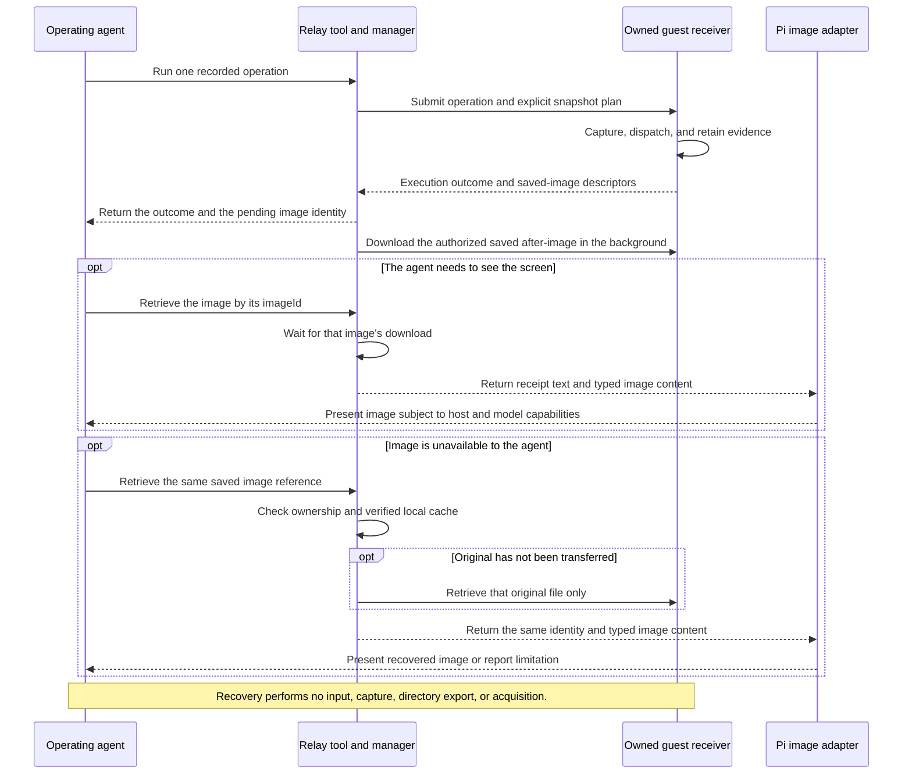

# Design: Screenshot delivery independent of archive extraction

## 1. Status and scope

- The user approved implementation after the original documentation proposal on 2026-09-21. This document now describes the implemented and automated-tested worktree contract, not a deployed or live-accepted capability.
- At the time of this design the relay was one tool with thirteen actions: `search`, `probe`, `acquire`, `stage`, `run`, `image`, `extract`, `finish`, `release`, `acquisition-capabilities`, `console-resolve`, `console-open`, and `console-cancel`. Each action is now its own `relay_*` MCP tool (the `image` action described here is `relay_image`); the selectors and limits below are unchanged by that split. The installed plugin and consumer integrations were not modified; an existing installed session must not be assumed to expose this revision.
- This document owns the screenshot-delivery contract. The [investigation and implementation plan](../.plans/2026-09-21-screenshot-delivery.md) retains the diagnosis, source provenance, original proposal, and pending work. The [verification report](verification.md#screenshot-delivery-investigation-2026-09-21) records measured evidence separately.
- Relay owns display-image delivery, authorized single-image retrieval, identity, transfer, and failure recovery. Application integration remains outside this design's implementation scope.
- Human live viewing is a separate capability. A viewer window cannot replace an image delivered to the operating agent, and neither capability implies human review.

## 2. Historical diagnosis and problem

- At baseline revision `e077367427e6a46a39039434725881c21a979e3e`, the receiver saved display images, but the execution transport pulled only the JSON receipt and the tool returned text-only results. This is the original diagnosis, not the current worktree behavior.
- The current `extract` action retrieves declared files or entire declared directories. It neither selects a member of a declared directory nor returns typed image content.
- The baseline supported inspecting host-local images with an image-capable `read` tool and extracting individually declared application screenshots. Neither facility supplied the owner-scoped saved-image retrieval added by this worktree.
- Copying display images into application output violates the separation between Relay evidence and declared consumer artifacts. Repeated directory exports also create unnecessary copies of an accumulated run.
- Delivering a captured black image does not establish that the intended application was visible. Capture correctness, byte transfer, presentation, agent inspection, and human review require separate evidence.

## 3. Agent interaction

- A normal `run` result names its saved after-image whenever the snapshot plan captures that phase, with `imageDelivery.status: "pending"` and the image identity, and returns without waiting for the image to reach the host (§10). The host downloads the image in the background.
- An agent whose application requires visual observation calls `relay_image` with the returned `imageId` before it selects further exploratory input. That call waits only for that image's download, then attaches it.
- A standalone event and a text group's last event can produce an after-image. A first or intermediate group event does not invent an after-image. Diagnostic execution remains explicitly without screenshot evidence.
- Before-images remain retrievable for diagnosis. Command results name only the captured after-image to keep results bounded.
- If delivery fails, the agent retrieves the same saved image. Recovery never repeats an input event, creates another capture, exports the consumer directory, or allocates another VM.
- An application screenshot is retrieved separately when the application requires inspection of that exact artifact. It never substitutes silently for a Relay display image.


```mermaid
sequenceDiagram
    participant Agent as Operating agent
    participant Relay as Relay tool and manager
    participant Guest as Owned guest receiver
    participant Host as Pi image adapter
    Agent->>Relay: Run one recorded operation
    Relay->>Guest: Submit operation and explicit snapshot plan
    Guest->>Guest: Capture, dispatch, and retain evidence
    Guest-->>Relay: Execution outcome and saved-image descriptors
    Relay-->>Agent: Return the outcome and the pending image identity
    Relay->>Guest: Download the authorized saved after-image in the background
    opt The agent needs to see the screen
        Agent->>Relay: Retrieve the image by its imageId
        Relay->>Relay: Wait for that image's download
        Relay-->>Host: Return receipt text and typed image content
        Host-->>Agent: Present image subject to host and model capabilities
    end
    opt Image is unavailable to the agent
        Agent->>Relay: Retrieve the same saved image reference
        Relay->>Relay: Check ownership and verified local cache
        opt Original has not been transferred
            Relay->>Guest: Retrieve that original file only
        end
        Relay-->>Host: Return the same identity and typed image content
        Host-->>Agent: Present recovered image or report limitation
    end
    Note over Agent,Guest: Recovery performs no input, capture, directory export, or acquisition.
```

## 4. Command-result contract

- New receiver responses describe actual saved captures without rewriting original journals or capture bytes. Relay correlates each descriptor against its submitted request and authoritative recorded evidence before accepting it.
- Each display descriptor identifies the owned enclosure, recording `sessionId`, `executionId`, `actionId`, `stepId`, `phase`, `capturedAt`, and optional `groupId`.
- Each image descriptor includes an opaque `imageId`, original `sha256`, `bytes`, and `mimeType`. It includes dimensions when decoded and an authorized host-local original path after materialization.
- The result carries the image identity in visible text and structured details. Identity and recovery information remain outside truncatable command output.
- The image appears in the final returned `content` array using Pi's typed image block. A progress update, metadata object, filesystem path, or base64 string in text is not sufficient.
- A `run` result carries no display image block. Its `imageDelivery` has the status `pending` and the image identity; `relay_image` returns the image (§10). A target tool's own images in a `run` result are delivered inline as before.

```ts
{
  content: [
    { type: "text", text: "<execution outcome and image identity>" },
    { type: "image", data: "<base64 bytes>", mimeType: "image/png" }
  ],
  details: {
    kind: "relay-image-result-v1",
    isError: false, // True for execution or image-delivery failure.
    result: { /* execution outcome */ },
    imageDelivery: { /* status, image identity, and presentation metadata */ }
  }
}
```

- Execution and image delivery remain independent outcomes. A completed command can have failed image delivery. Recovering an image does not turn an uncertain or failed command into a successful command.
- Pi turns thrown execution errors into text-only results. For image-bearing failures, Relay returns the structured result and uses a narrowly scoped `tool_result` handler to set `isError` while preserving content. Returning an arbitrary `isError` field from `execute` is not a supported substitute.
- Invalid requests are rejected before effects. Real Pi SDK 0.85.1 tests verify that final text, images, and native error flags survive the extension hook, execution events, session persistence, and next-turn context. Legacy failed results without `imageDelivery` retain their throwing behavior.

## 5. Implemented single-image retrieval tool

- Verified single-file materialization uses the existing controlled transfer channel with image-specific integrity, size, deadline, and retry checks. It introduces no unrestricted guest-read endpoint or new backend communication channel.
- The closed `relay_image` tool retrieves one saved image. `relay_extract` remains dedicated to declared archive delivery rather than image presentation.
- The tool rejects `reason` because it performs no recorded input. It selects exactly one target through the following closed branches. Replace illustrative identifiers with actual returned identities; reference IDs are `image-` followed by 64 lowercase hexadecimal digits.

### 5.1 Display selection

```json
relay_image {"target":{"source":"display","sessionId":"<recording-session>","executionId":"<saved-execution>","phase":"after"}}
```

- The required phase is `before` or `after`. The selector resolves recorded captures belonging to the owned enclosure and accepts no guest path, VM name, backend URL, or caller-supplied owner identity.
- A selector for a phase that was not requested returns `not-requested`. It never returns the most recent image instead.

### 5.2 Application selection

```json
relay_image {"target":{"source":"application","name":"<declared-extraction>","path":"shots/0000-initial.png"}}
```

- The name must match an acquisition-time extraction declaration. A directory declaration requires a nonempty relative path to one regular image file. A file declaration omits `path`.
- Selecting a member of a declared directory does not export its siblings. `fullWorkspace` does not grant an implicit image declaration in this initial design.
- The first verified selection fixes the original hash and creates an image reference. The descriptor identifies the declaration, relative path, and retrieval time. Application-supplied capture metadata is not treated as a Relay display association.

### 5.3 Reference recovery

```json
relay_image {"target":{"source":"reference","imageId":"<returned-image-reference>"}}
```

- A reference resolves to the same original bytes or an explicit integrity or availability failure. It cannot silently select a newer file at the same path.
- Immutable private catalog entries bind each reference to its owner, enclosure, backend binding, source type, original hash, and evidence identity. Existing entries are validated rather than replaced. An opaque reference is a lookup key, not a bearer credential.
- Once an original has been identified and its reference issued, retries preserve that reference even if the initial transfer failed. Failure before an original can be identified must not fabricate a reference or hash.
- Retrieval uses the manager's ownership lock and serialization. Read-only infrastructure stat and hash operations are allowed, but receiver admission, UI input, capture, directory extraction, and acquisition are not.

## 6. Security, storage, and lifecycle

- Keep Relay display originals in Relay-owned evidence storage, outside the guest workspace and declared consumer output. Retain application observations separately and label their source explicitly.
- Use private temporary destinations, regular-file checks, canonical path confinement, non-symlink ancestor checks, size bounds, and original hash verification before publishing a retrieved image.
- Reject absolute paths, traversal, symlinks, special files, unsupported image formats, unrelated sessions, and changing sources. Retrieval never grants access to arbitrary guest state, home directories, credential packs, or backend credentials.
- Originals are limited to 64 MiB, 40,000,000 decoded pixels, and 32,768 pixels per dimension. PNG, JPEG, and WebP are supported. Previews are limited to 2,000 × 2,000 pixels and **4 MiB of base64-encoded data**, not 4 MiB of decoded image bytes. Image JSON/journal metadata files are each limited to 4 MiB.
- Existing originals are verified before reuse. A conflicting hash is an integrity failure. Before final state merge, verified display originals are materialized at canonical `state/snapshots/<sessionId>/<fileName>` paths. The merge rejects conflicting bytes before replacement, retains older snapshots absent from incoming state, and archives prior state under unique attempt paths. Sealed packages are not refreshed.
- Reference associations survive recording resets across the current owner's retained `previousEvidence` lineages. Local metadata and original recovery precede guest checks, so verified local recovery does not require a reachable guest. Foreign or guessed recording directories are not authorized.
- After enclosure closure or sealing, the retrieval action reports `stale-reference` rather than reacquiring a VM. Delivered host-local originals remain inspectable through `read` and the verified package.
- Normal successful finalization exports the declared consumer directory once. Single-image retrieval never calls `extractInternal` or produces a collector-directory extraction receipt.
- Explicit retries of failed finalization retain earlier attempts. Named extractions and `fullWorkspace` exports use UUID destinations; finalization no longer reuses a fixed full-workspace destination.
- Preserve immutable snapshot records, package integrity checks, incomplete-group reporting, independent execution grading, and verified VM destruction. Retrieval does not seal a package or imply human review.

## 7. Presentation and host dependencies

- Pi's tool-content shape is `{ type: "image", data, mimeType }`, where `data` contains base64 bytes without a data-URL prefix. Anthropic's nested `source` object belongs to its downstream wire format, not the extension return value.
- Pi can resize or convert tool images and append transformation hints. If Relay creates a preview, retain its association with the unchanged original, dimensions, MIME type, hash, and transformation parameters separately.
- Relay uses the supported public `resizeImage` helper from `@earendil-works/pi-coding-agent`, tested with Pi 0.85.1. Preview receipts retain the policy, original and preview dimensions, MIME type, hash, size, and transformation flag separately from original bytes. Further host normalization can change provider-bound bytes after Relay returns.
- Real SDK tests verify that `images.blockImages` replaces images with a disabled-image placeholder in model context without discarding persisted evidence. Offline provider tests verify non-vision placeholders. Relay does not bypass these host controls, and attachment does not establish what an actual model received.
- Offline tests cover normal and error image results through OpenAI Responses, Chat Completions, Anthropic, and Google adapters. OpenAI Responses uses multimodal `function_call_output.output`; Chat Completions places tool images in a subsequent user message. The tests stop before network dispatch. The exact affected gateway must still be verified against its actual adapter representation.
- Secretary's inspected child request path preserves image-bearing messages, while its text-oriented inspector is not proof of what the child model receives. The exact affected session's runtime, adapter, settings, and gateway acceptance remain unverified.
- A release report must identify the tested and loaded Relay revision, Pi runtime, provider adapter, and required capabilities. A package version or source commit alone is insufficient.

## 8. Failure outcomes and bounded recovery

| Outcome | Meaning and permitted response |
|---|---|
| `not-requested` | The snapshot plan did not request this phase. No image is synthesized. |
| `capture-failed` | The required original was not captured. Retrieval cannot repair capture. |
| `capture-unknown` | Available evidence cannot establish capture completion. Resolve saved records without replaying input. |
| `unauthorized-reference` | The reference or recording session does not belong to the owner. Foreign file details are not disclosed. |
| `unsafe-path` | The selection violates confinement or file-type restrictions. Do not retry unchanged. |
| `image-missing` | An authorized selection has no available file. |
| `stale-reference` | The enclosure is closed or the recorded source is no longer available under that ownership. |
| `integrity-failed` | Bytes or associations conflict with recorded evidence. Preserve the conflict rather than overwriting it. |
| `transfer-failed` | Verified transfer exhausted its attempts or deadline. Recovery can retry only the same original. |
| `presentation-unavailable` | The supported host path cannot decode or present the image. A path or encoded string is not visual success. |
| `attached` | Relay included a typed image block in its final result. Provider acceptance and inspection remain unconfirmed. |
| `pending` | Only in a `run` result: the after-image is captured and its identity is known, and the host downloads it in the background (§10). Retrieve it with `relay_image` to see it. |

- Each inline image-delivery phase or retrieval call has a 90-second total deadline and a shared budget of three byte-transfer attempts, including metadata transfers and initial attempts. Metadata work, original transfer, and presentation share the deadline; the budget is not renewed for each metadata file. This deadline is separate from command execution and the agent-selected snapshot interval.
- Cancellation and the deadline propagate through metadata reads and transfers. A late unverified result must not be published after cancellation or timeout.
- Retry only eligible transient transfer failures. Authorization, unsafe-path, capture, unsupported-format, and integrity failures are not automatically retried. A verified cached image needs no guest transfer.
- Recommend at most two explicit recovery calls for the same reference after inline delivery fails. Consumers may impose a smaller retry or time budget. Relay does not loop automatically across calls.
- If the agent still cannot inspect a required image, it stops exploratory input and finalizes or abandons under the application's budget. This design does not permit replaying an uncertain click or scroll as image recovery.

## 9. Acceptance and rollout

### Current automated status

- The user-approved implementation is present in this worktree. Build, typecheck, RPC smoke, and clean-install checks passed. These checks do not mean the installed plugin or consumer source was changed.
- The pre-merge screenshot-delivery `npm test` run contains 438 tests: 435 passed, two failed, and one was skipped. The failures require missing historical `test-evidence/ubuntu-20260912-2127` and sibling `pilot-images/inventory/collect.py` fixtures. They remain failed checks; not all gates passed.
- Automated coverage includes closed selectors, transfer bounds, immutable references, recording-lineage recovery, canonical original merging, finalization attempts, Pi SDK 0.85.1 image/error handling, image blocking, and four offline provider adapters.
- No new live model or VM acceptance was performed for this implementation. The exact affected gateway, agent inspection, human review, and deployment remain unverified. Historical diagnoses and original proposals in the investigation plan are retained as historical evidence rather than rewritten as successful acceptance.

### Remaining live acceptance and rollout requirements

- Verify a controlled multi-step session with spatially asymmetric content, correctly associated display images, and no intermediate consumer-directory exports.
- Verify recovery of the same hash without another input, capture, directory export, or VM acquisition. Test both a missing initial transfer and a verified local cache.
- Verify exact application-image selection, declaration restrictions, unsafe paths, foreign sessions, stale references, missing images, changing sources, and transfer failures.
- Verify before/after identity, first/member/last groups, incomplete groups, failed operations, recording reset, reload, and image-preserving error flags through the real Pi SDK.
- Verify that presentation transformations leave original archive bytes unchanged. Test image blocking, non-image models, and the actual selected adapter without treating serialization as proof of agent inspection.
- Verify one consumer-directory export at normal finalization, preservation of earlier failed-finalization attempts, package integrity, and actual isolated-VM destruction.
- Build and clean-install checks have passed for the worktree. Before deployment, identify the exact revision and bundle that the target session will load; changing source does not update an already-running installed session.
- Report automated results, agentic inspection, human review, capture-path mismatches, and consumer archive verification separately. Do not use a live Discord run for acceptance or rewrite historical evidence.

## 10. Background download of step evidence

The decisions are DC-1 to DC-7 in the [screenshot delivery record](decisions.md#screenshot-delivery) and DC-9 to DC-11 in the [evidence download record](decisions.md#evidence-download).

### Problem

- `run` used to deliver its after-image before it returned. In a 155-operation run on a 3840 × 2160 macOS display, that delivery took a median of 5.5 s per operation and 860 s in total, half of the 1,713 s run.
- With the after-image downloaded in the background, `finish` still pulls the rest of each step's evidence: its before-image, its started marker, its execution and action records, and its tool result. The verified pull (`pullVerified`) makes three guest commands and one pull for each file.
- In a 144-operation run over the vm-service session link, `finish` took 98.4 s. It made 3,282 requests to the vm-service: 2,461 commands took 67.8 s and 815 pulls took 10.1 s. The bytes were not the cost; the round trips per file were.

### AD-1: the run result names the image without waiting for it

- `run` returns as soon as the guest's receipt is filed (DC-1, DC-2). There is no option to wait.
- The result's `imageDelivery` has the status `pending` and the image identity. The relay derives the identity from the receipt's saved-image descriptor on the host, with no guest I/O: `imageId`, `sessionId`, `executionId`, `actionId`, `stepId`, `phase`, `capturedAt`, `groupId`, `sha256`, `bytes`, `mimeType`, and `originalPath`.
- `originalPath` is where the original will be. A caller must not read it until a `relay_image` call reports `attached`, or until the package is delivered.
- When the host cannot derive the identity without the guest, the result is `pending` without an image identity. The display selector of §5.1 still retrieves the image.
- `pending` is not an error. A failed later download does not change the run's result.

```ts
imageDelivery: {
  status: "pending",
  image: { imageId, source: "display", sessionId, executionId, actionId, stepId, phase: "after", capturedAt, sha256, bytes, mimeType, originalPath }
}
```

### AD-2: one background download queue per enclosure, one download per step

- Every operation whose receipt the guest filed queues one download of that step's evidence (DC-9). A diagnostic command, a refused call and an operation without a receipt queue nothing.
- The relay derives the step's file set on the host from the receipt it already holds, with no guest I/O. All paths are relative to the guest root:
  - `state/receiver/started/<executionId>.json`;
  - `state/receiver/receipts/<executionId>.json`;
  - `state/records/execution/<executionId>.json`;
  - `state/records/action/<actionId>.json` for each action in the receipt's `imageEvidence.snapshots`;
  - `state/snapshots/<sessionId>/<fileName>` for each before- and after-image in `imageEvidence.snapshots`;
  - `workspace/relay-run/<resultFile>` when the receipt's output names a `relay-run` result file.
- A file the receipt does not name is not part of a step: the shared journal, `state/receiver/groups.json`, application images and other workspace files. The finish fetches them (AD-9).
- The download carries the step's files in one archive (AD-8). It files the after-image original in the image catalogue as before: it checks the action record, registers the catalogue entry, and writes a delivery receipt with the status `downloaded`. The preview is made only when `relay_image` asks for the image.
- One worker per enclosure runs the downloads in order (DC-4). It runs outside the manager's serialized section, so the next operation does not wait for it, and in the manager process, which holds the owner lock.
- The queue is bounded at 64 downloads (DC-4). When it is over the bound, `run` waits for the oldest download to end before it returns. While the worker is paused (AD-4) the bound does not make a run wait.
- Cancelling a `run` does not cancel its download. The download is evidence of input that was already sent.
- Each download writes a record to `host/evidence-downloads/<executionId>.json` when it ends: its status, the files it holds with their hashes and sizes, the after-image identity when known, and the times it was queued, started and ended.

### AD-3: `relay_image` waits only for the image it names

- When a reference or display selector names an image of a step whose download has not started, the worker takes it next. When the download is in flight, `relay_image` waits for it. There is never a second transfer of the same original at the same time.
- A `relay_image` call that names a queued download runs it next even while the worker is paused (AD-4), because the call itself asks for the guest. Without that, the call would wait out its deadline behind a paused worker.
- After the wait, `relay_image` works as before: it finds the verified original on the host and makes the preview. A before-image is found in the step folder (AD-7). When the download failed, `relay_image` makes its own attempt with a fresh budget, as in §8.
- A reference names an image before any download has checked it (AD-1). When the step download failed before the image was catalogued, `relay_image` resolves the reference through the display selector the run named, which checks and catalogues the image as the download would have. The resolved identity must equal the reference.
- The 90-second deadline of the call counts from the call, and covers the wait. When the deadline passes during the wait, the result is `transfer-failed` with the image identity, and the download goes on in the background.

### AD-4: retry stays inside one download

- A download has a 90-second deadline from the moment the worker starts it, and three transfer attempts. Each attempt is one archive pull with no retry of its own, so the waits below are the only waits.
- It retries only eligible transient transfer failures, as in §8. Between attempts it waits 1 s, then 3 s (DC-5).
- Lasting failures are not retried: authorization, unsafe-path, capture, unsupported-format and integrity failures.
- A file the guest does not hold is not a failure of the download. The archive leaves it out, and the record lists it as missing. The finish's pull decides whether the evidence is complete.
- A download that ends without the step's files is not queued again. Two later paths fetch them: `relay_image` with a fresh budget for an image, and the finish (AD-9).
- After a download fails with a transient failure, the worker pauses (DC-7). It resumes when the next relay operation reaches the guest and completes, or when a download that `relay_image` asked for succeeds. Without the pause, one network outage would spend the attempts of every queued download.
- A download only copies files again. It never repeats input or takes another capture.
- `relay_status` reports the downloads that are queued, in flight, downloaded, failed, cancelled and coalesced, and whether the worker is paused. A download counts as ended only after its record is written.

### AD-5: the gate before lifecycle operations and before the owner lock is released

- The queue has three states: open, closing and closed. A run queues a download only while the queue is open.
- `finish`, `release` and a recording reset close the queue at the start of their serialized section, before they touch the guest state (DC-3). Each one:
  1. lifts the pause of AD-4, because the operation itself needs the guest;
  2. waits for the download in flight to end, by success or by recorded failure;
  3. ends every download that has not started with the status `coalesced` (DC-11). Its files are fetched in the operation's own archive (AD-9), so the wait does not grow with the queue.
- The queue opens again when the operation ends, whether it succeeded or failed. A failed finish keeps the VM, and further runs are allowed.
- `cleanup` closes the queue, aborts the download in flight, waits for it to stop, and then releases the owner lock. `pauseNow` aborts it without waiting, because the process exits right after. A closed queue writes nothing more: an aborted download does not publish, and its record is not written.
- The queue lives in memory. Downloads lost with the process cost no evidence: the next manager's `finish` pulls what the host lacks, and `relay_image` retrieves on demand.

### AD-6: the finish reuses files the host already holds

- The verified pull (`pullVerified`) of `finish`, `release`, a recording reset and an extraction takes host copies as a local source (DC-6). For each file in the guest scan it first tries a host file that should hold the same bytes:
  - the same relative path under the recording's host `state` directory;
  - the same relative path in any step folder (AD-7);
  - for a receipt, the copy in `host/receiver-receipts/` that the transport filed during the run;
  - any verified original under `host/images/` with the same hash and size. Identical screenshots therefore share one held original. A catalogue entry that does not load is skipped.
- It checks a candidate's hash and size against the guest scan. A candidate with a wrong hash is discarded, never used. A file that changed after its step downloaded, such as an action record a later step rewrote, therefore comes from the guest.
- The scans before and after the pull, the inventory comparison and package delivery are unchanged, so `deliveryVerified` and `snapshots` mean what they meant before.

### AD-7: each step's evidence has a folder of its own on the host

- A step's download unpacks into `host/steps/<executionId>/`, under the same relative paths the files have in the guest root (DC-10). For example, the step's execution record is at `host/steps/<executionId>/state/records/execution/<executionId>.json`.
- The guest layout is unchanged. The guest's record and snapshot stores own it, and the package and its readers depend on it.
- The step folders are a staging area, not part of the package. When the package is delivered, the files the finish used from them are in the package's `state` tree or extraction, and the relay removes the step folders. The package therefore holds each file once, as before.
- When the finish fails, the step folders stay, so the next `finish` reuses them.

### AD-8: one archive carries one step's files

- The worker's download of a step makes four requests: one guest command that writes the archive, one path check, one pull, and one guest command that removes the archive.
- The first command receives the relative paths as arguments. For each path it applies the checks of a verified file pull: the path stays inside the tree and the guest root, and the file is a regular file and not a link. It writes the files into one archive file in the guest root, beside the inventory frames, and prints only the archive's path and size.
- Before it writes, the command checks that the guest has free space for the archive. It removes a partial archive on any failure.
- The archive has the relay's own uncompressed format. Each entry is one JSON header line with the relative path and the size, then exactly that many bytes, then one JSON line with the SHA-256 hash of those bytes. The guest reads each file once to hash and write it. The format is uncompressed because PNG originals do not compress further.
- The host knows the archive's exact size before the guest writes it, and refuses an archive of another size.
- The host unpacks the archive into a fresh staging directory and accepts it only when every entry is valid:
  - the entries are exactly the requested paths, in order, and no path appears twice;
  - each path is relative and has no `..` or empty segment;
  - each entry's size and hash match the header, the hash line, and the guest scan;
  - the archive ends exactly after the last entry.
- An archive that fails a check is discarded whole. Accepted files are then linked into place, and the staging directory is removed.
- One guest command carries at most 64 KiB of paths. A longer request is split into several archives, so the number of requests grows with the bytes of the paths, not with the number of files: about one archive per 700 files of today's path lengths.
- The same format and checks serve the finish's archive (AD-9).

### AD-9: the finish coalesces what is pending into one archive

- After the gate of AD-5, the verified pull of `finish`, `release` and a recording reset works in this order (DC-11):
  1. It scans the guest `state` tree once, as now.
  2. It takes every file that has a matching host candidate (AD-6) from the host.
  3. It writes every other file into one archive in the guest, pulls it, and unpacks it with the checks of AD-8. These are the files of coalesced and failed downloads, and the shared files that belong to no step.
  4. It scans again and compares, as now.
- The declared extractions, such as `relay-run`, work the same way: one scan, host candidates from the step folders, and one archive for the rest. An extraction of a single file takes a matching host candidate instead of its pull.
- The archive removes the per-file round trips: the finish makes a fixed number of requests, whatever the number of steps.

### AD-10: the finish falls back to the per-file pull when the archive cannot be built

- Before the archive is built, the relay checks the guest's free space for the archive's size, as it checks the host's free space now.
- When the guest lacks the space, or when building, pulling or unpacking the archive fails, the finish falls back to the per-file pull for the files it still lacks. The fallback is slower but needs no extra guest space.
- The fallback is logged with its reason, so a slow finish can be explained from the evidence.
