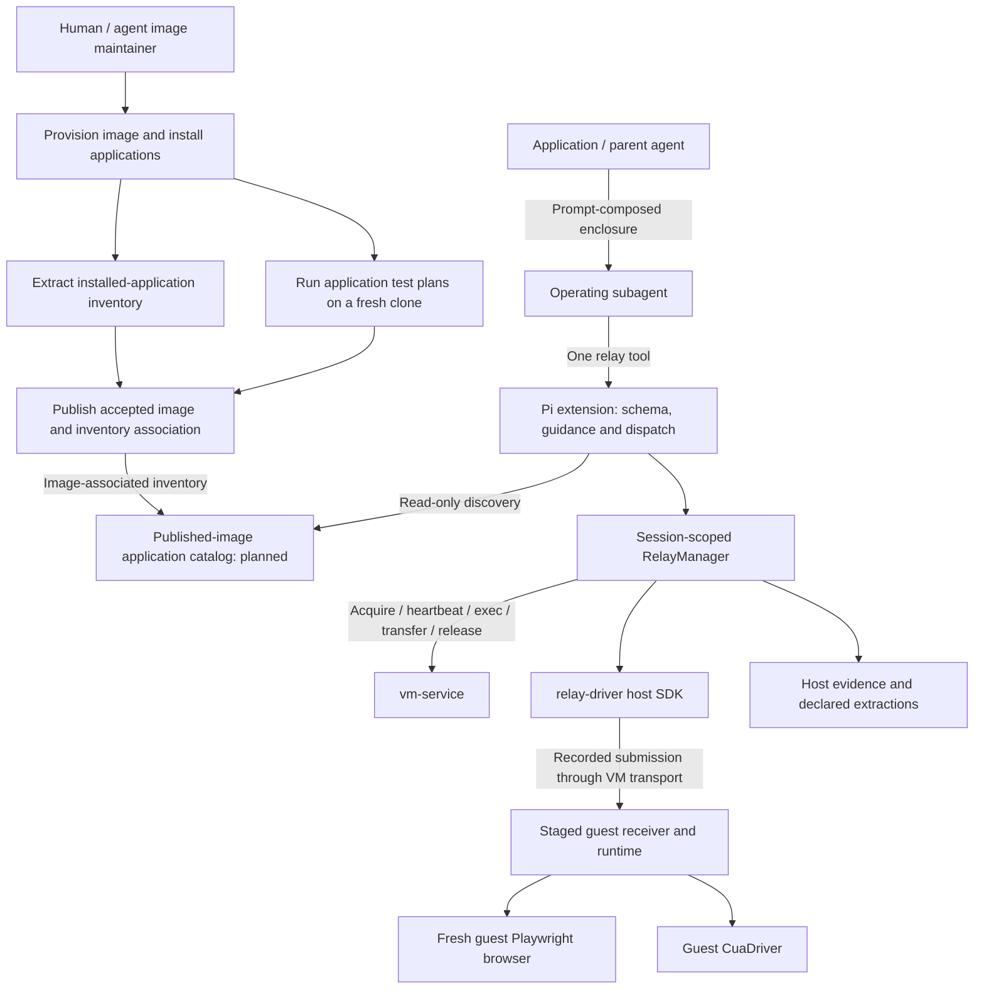
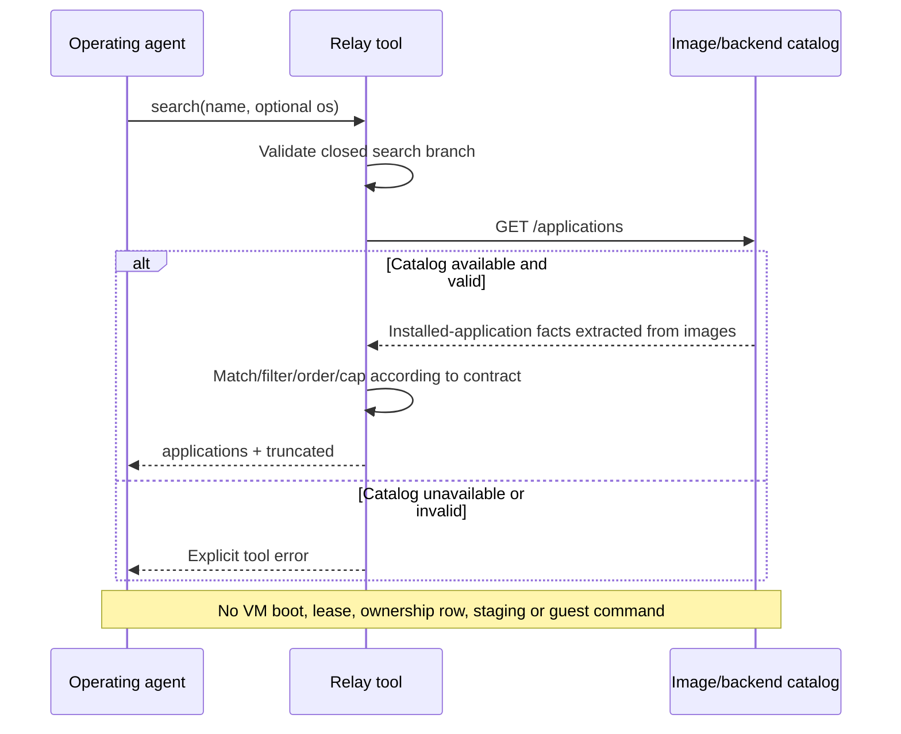
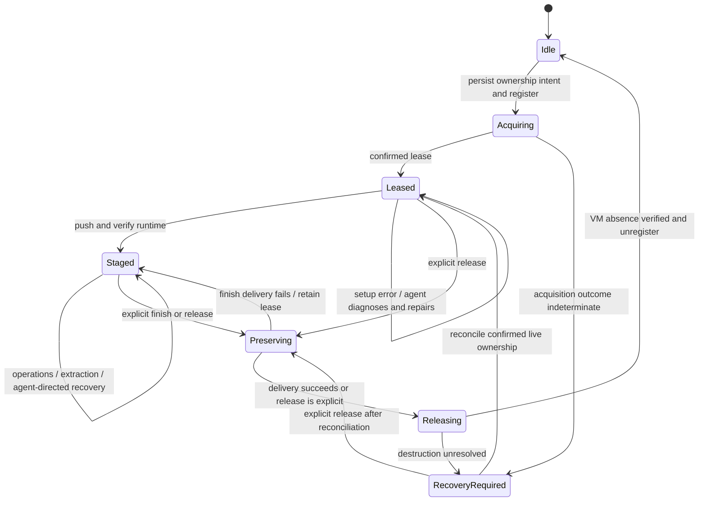

# Technical Design: Relay Runtime and Application Discovery

| Item | Value |
|---|---|
| Document type | Engineering design / RFC |
| Status | Recovery, the guest-sharing console contract, and screenshot delivery are implemented with automated tests. Deployment and live acceptance remain separate; see verification.md. |
| Scope | Pi extension; application-catalog integration requires coordinated image/backend work |
| Related documents | [Overview and status](design.md), [UX specification](ux-design.md), [implementation evidence](verification.md) |

## 1. Context, goals and constraints

pi-vm-relay is a thin TypeScript Pi extension over vm-service and relay-driver.
It exposes one `relay` tool and two commands, enforcing dedicated VM ownership,
recorded execution, declared extraction and verifiable cleanup. Non-interruptive
local work stays with the agent's local tools; the extension supplies routing
facts, not a local CUA implementation.

The interface combines read-only application-name discovery with a dedicated
VM lifecycle and recorded execution. Search does not create an enclosure.
Execution, evidence, heartbeat, locking and cleanup are independent guarantees.

Goals:

- Discover published images from maintained application metadata without a boot.
- Preserve a closed action-discriminated schema with strict local validation.
- Keep the runtime and evidence contracts independent of tool count.
- Preserve durable execution intent and structured lifecycle records.
- Keep installation portable through native Pi Git package management.

Non-goals: category/semantic search, cached pagination, automatic image selection,
physical machines, local CUA execution, CDP attachment, extension-owned video,
programmatic subagent spawning, or a rewrite of relay-driver.

## 2. System architecture and ownership



| Component | Responsibility |
|---|---|
| Pi extension (`src/index.ts`, `src/schema.ts`, `src/tool.ts`) | Registration, model guidance, validation, bounded rendering and action dispatch |
| `RelayManager` | Durable ownership, same-session operation ordering, lease heartbeat, staging, delivery and cleanup |
| vm-service | Disposable leases, guest command/transfer API, guest sharing, service-host viewer management, access revocation and verified destruction. |
| relay-driver | Recorded/admitted submissions, journal, durable receipts, snapshots and evidence-package substrate |
| Image/backend layer (planned integration) | Authoritative published-image application inventory and search/catalog API |
| Application such as Walkthrough | Prompt composition and any full-display video requirements |

Applications do not call vm-service/relay-driver directly. They prompt a subagent
that operates `relay`. Pi-vm-relay has no programmatic spawn/enclose API.

The integration consumes HTTP (`POST /acquire`,
`/vms/<n>/exec|push|pull|release`, inventory and heartbeat). The coordinated
[search contract](search-contract.md) specifies `GET /applications` over extracted
image inventories. This is an implementation target, not an assertion that the
currently deployed service already exposes it.

The relay-driver implementation is consumed unchanged. Maintainer builds embed
compiled SDK/runtime code with version, source-hash and license provenance.
Consumers do not need sibling source repositories. vm-service remains separately
installed and operated.

## 3. Public API contract

### 3.1 Registration and action discrimination

Register exactly one model tool, `relay`, through one `pi.registerTool` call.
A required `action` selects one of thirteen operations; no legacy `relay_*` aliases or extra
search tool are allowed. Keep `/relay-status` and `/relay-review <pkg>`.

Only `action` is universally required. Each branch is closed: fields not listed
for that action are invalid. `run.reason` is a required nonblank string of at most
4,000 characters, used as an execution-intent annotation rather than an identity,
authorization or retry key. `console-open.reason` has the same bounds and is the
only lifecycle exception. Other actions reject `reason`.

| Action | Fields beyond `action` in the public contract |
|---|---|
| `search` | Required `name`; optional `os` |
| `probe` | Optional `scope` selects `"host"` or `"guest"`; host is the default. Host reports service and owned state; guest performs bounded executable checks without claiming capture or browser readiness. |
| `acquisition-capabilities` | No other fields are allowed. It reads startup capability metadata without allocation or ownership recovery. |
| `acquire` | Required `task`, `image`, `extractions`; optional `ttlHours`, `env`, `fullWorkspace`, `vnc`. VNC preparation is acquisition-time opt-in and never opens a viewer. |
| `console-resolve` | No other fields are allowed. It reconciles the owned lease and resolves its console. |
| `console-open` | Required `console_id`, `attempt_id`, `userRequested: true`, `reason`, and `expected`. It opens the service-host viewer only following an explicit user request. |
| `console-cancel` | Required `console_id` and `attempt_id`. It cancels managed viewing resources without releasing the lease. |
| `stage` | Optional `workspace`, `files`, `nodePath`, `cuaDriver`, `browser`, and explicit `resetRecording`. |
| `run` | Required `reason`, `kind`, `step`, `snapshots`, and kind-specific fields; optional `timeoutMs`. |
| `image` | Required closed `target`: display `{source:"display", sessionId, executionId, phase:"before"|"after"}`, application `{source:"application", name, path?}`, or reference `{source:"reference", imageId}`. |
| `extract` | Required `names` |
| `finish` | None |
| `release` | None |

`run.kind` remains `exec | script | code | cua | browser`, selecting respectively
`argv`, `localPath`/`language`, `code`/`language`, `tool`/`args`, or `browser`.

- The existing `exec` branch accepts optional `diagnostic: true` for explicitly requested diagnosis or repair without screenshot evidence. It uses the owned vm-service command channel before or after staging, so damaged capture or guest recording state cannot prevent diagnosis. It keeps required intent, step, and standalone snapshot metadata for a consistent request shape, but records that screenshots were not requested.
- Diagnostic commands cannot join screenshot groups. Their output and receipts are retained on the host, and evidence review identifies them as command-only rather than visual verification.
- `stage.resetRecording: true` archives the previous guest recording state and host evidence, starts a new recording session in the same VM, and returns references to previous evidence. It does not delete a receiver lock or imply that historical damaged evidence passed verification. An interrupted reset is reconciled using its persisted identity.

`browser.action` selects `navigate | click | type | press | read`; it is not the
top-level tool action. Existing nested-field bounds, confinement, explicit
snapshot intervals and group rules remain in force.

Reject unknown actions, missing fields and cross-action payloads before effects.
No default action, fallback dispatch or schema consisting only of optional fields.

### 3.2 Search request

```ts
type SearchInput = {
  action: "search";
  name: string;
  os?: "linux" | "macos";
};
```

`name` must be nonblank; trim surrounding whitespace for matching. Blank input is
invalid, not list-all. `os` is a hard filter, with no preference behavior. Omit it
to search both families. ARM Linux is OS `linux` plus architecture `arm64`, not a
third OS. No architecture filter is offered initially.

Only the fields in `SearchInput` are accepted. There is no category taxonomy,
fuzzy/semantic matching, caller-specified limit or pagination.

### 3.3 Search response

```ts
type SearchResult = {
  applications: Array<{
    name: string;
    installations: Array<{
      image: string;
      version: string | null;
      os: "linux" | "macos";
      architecture: string;
    }>;
  }>;
  truncated: boolean;
};
```

- `name` is the canonical application display name, even if an alias matched.
- `image` is the exact published identifier accepted by `acquire`.
- `version` is the installed version, or `null` when an installed application has
  no available version identifier. Never guess it or treat it as a verification flag.
- `architecture` is the image's actual canonical CPU architecture (e.g. `arm64`,
  `x86_64`); only actual catalogued images are returned.
- `truncated` means at least one matching application or installation was omitted
  because of the response cap.

No verification, instructions, category, score or continuation metadata appears
in results. No match returns `{"applications":[],"truncated":false}`. Catalog
failure/malformed data is an explicit tool error, not an empty success.

An image match is neither a lease nor a capacity reservation; acquisition remains
explicit and may fail through the normal availability checks. No new public image
revision/precondition field is adopted in this first search contract.

### 3.4 Provider compatibility

The implemented schema projects fields into a root object and retains complete
closed branches in `anyOf`; the executor independently validates the authoritative
union and conditional snapshot intervals before manager access.

Offline serialization tests of installed Pi adapters show OpenAI Responses,
OpenAI Completions and Google preserve this schema. Anthropic reconstructs the
root and drops `anyOf` and `additionalProperties`. Its model sees weaker
conditional constraints, but local enforcement remains strict. This fallback
requires no provider patch and does not establish live endpoint acceptance.
Provider-side strict sampling is not requested.

The root `required` must contain only `action`. `name` is required only by
`search`, and `reason` is required only by `run` and `console-open`. Model-facing descriptions
must explain conditional requirements even when a provider drops the union.
Reverify real registered schemas and adapter payloads rather than assuming support.

### 3.5 Execution timeout

- The `run` action accepts an optional `timeoutMs` for all operation kinds. It defaults to 120,000 ms and accepts positive integers up to 3,600,000 ms. The effective limit is documented and reported.
- The timeout measures the dispatched operation's runtime. It does not include staging, the before-snapshot, the requested after-snapshot delay, or evidence transfer.
- A timeout may terminate the current operation and its owned child processes. It must not stop or delete the VM, terminate an unrelated guest service, or reject subsequent agent operations merely because this operation timed out.
- The response states the effective timeout, whether termination was confirmed, the execution outcome, available standard output and standard error, the evidence location, and the actual lease state. An uncertain outcome must remain uncertain.
- The tool does not automatically replay a timed-out operation. The agent may inspect the guest, repair the environment, and submit another operation with a new execution identity.
- The selected timeout must reach the guest receiver. SDK framing, vm-service deadlines, transport deadlines, capture allowances, and browser-operation deadlines must not silently impose a shorter limit. A persistent browser operation must not continue issuing input unnoticed after its caller reports a timeout.
- `snapshots.afterIntervalMs` continues to control only the after-snapshot delay. `acquire.ttlHours` continues to control lease lifetime. Neither is a command timeout.
- The previous release used the 120,000 ms default without a public override. The revised implementation retains that default and propagates the configurable limit through the receiver and transport.

### 3.6 Host observations and guest readiness

- The existing `probe` action reads host permissions, recording status, foreground application, user-session activity, and idle time. It also reads VM-service availability, images, and capacity. It does not establish guest readiness.
- On macOS, the host idle-time query is `ioreg -r -c IOHIDSystem`. The `-r` option restricts output to the matching subtree. Idle time remains `HIDIdleTime / 1e9` seconds; the measurement formula does not change.
- Idle time is supporting information, not proof that the user is absent or authorization to interrupt the display. An unavailable observation must be reported as unknown.
- Guest readiness checks verify the acquired guest's executables, service startup, capture capability, and browser operation. They must be clearly separate from host observations in tool descriptions and results.
- Guest readiness must not be presented as a capability of the existing host `probe`. Public actions and their results must match their documented scope.
- Readiness checks must not silently install software or repair an image. They report failures so the agent can decide how to proceed. Runtime checks supplement, rather than replace, image acceptance tests.
- Reuse existing actions and clearly separated results where they meet the requirement. Add a public action only to address a demonstrated gap, not as a prerequisite for implementing readiness checks.
- Basic guest checks must work before staging and after repair through the extension's controlled vm-service transport without depending on the capture service being tested. Results identify the owned guest, observation time, checks performed, and outcomes.
- Application launch and screenshot checks are explicit and clean up only resources they create. Staging reports transferred files and runtime setup; `staged: true` is not proof that every application works.

### 3.7 Selected environments and dependency injection

- [The selected-environment contract](selected-environments.md) defines the closed JSON profile and canonical configuration identity shared by relay, vm-service, and image tooling.
- The composition root selects dependencies once. Relay consumes a `VmBackend` protocol; the concrete client, Tart destruction verifier, image repository, and state roots are bound to that selection.
- Lease persistence includes backend binding. Health identity and request fingerprints prevent endpoint replacement or configuration drift from redirecting an existing command sequence.
- A separate Tart store is required for isolated environments. Git worktrees isolate source only, and mutable service/image/relay state remains separate from both source and production defaults.
- Profile loading is read-only. Service startup owns state/store markers and locks; mismatched identity is an error, never a reason to overwrite state or fall back to another repository.

### 3.8 Live viewing of the owned VM

- [The console consumer contract](console.md) defines the implemented fields, response projection, durable attempt reconciliation, and backend API. Component tests do not establish live viewer availability or acceptance.
- The backend uses unmodified Tart for normal boot and owns guest sharing, SSH transport, the bounded loopback broker, and standard viewer launch on the service host. Relay neither launches a client-side viewer nor obtains endpoints or credentials.
- Linux uses x11vnc inetd over SSH for the existing X11 session and TurboVNC's private-stdin password interface. The server enforces view-only access and creates no guest VNC TCP listener. Wayland and independent remote desktops are not supported.
- macOS uses built-in Screen Sharing, guest PF isolation checks, and Apple's standard viewer with human guest-account authentication. The human must choose Standard sharing of the existing console, not a new Log In session or High Performance display. `session_binding: viewer-selection-unverified` and `server_enforced_view_only: false` remain explicit limitations.
- `acquisition-capabilities` reads configuration, not live guest readiness. `acquire.vnc` defaults to false; omission preserves the old wire request, explicit false is forwarded, and true checks OS availability before allocation. A successful opted-in acquisition requires immutable `lease_id` and a ready `console.console_id`. Non-VNC leases are never retrofitted or restarted automatically.
- Resolve/open/cancel reports have top-level console `status` (`ready` or `revoked`) and a separate nested `attempt`. Attempt states include `preparing`, `dispatching`, `launched`, `cancelled`, `closed`, and `failed`. `readiness_scope: guest-console-preflight` is not viewing success. Missing observations remain unknown.
- `authentication_mechanism`, authentication status, `attempt.transport_connected`, viewer connection, pixels, and human confirmation are separate observations. An RFB banner proves transport progress only. The exact versioned schema and allowlisted fields are in [console.md](console.md#backend-api-expectations).

#### Scope and approval boundary

- Relay must support live human observation of the same leased graphical session used by guest execution and desktop capture. An evidence viewer or prerecorded video is not a substitute.
- Read-only capability discovery and owned-console resolution are separate from explicit viewer opening. The action table in Section 3.1 includes this implementation; exactly one model tool and two slash commands remain registered.
- Console branches reject screenshot metadata, executable paths, URLs, VM selectors, and environment overrides. `console-open.expected` is nonblank and at most 4,000 characters. Console and attempt identifiers match `^[A-Za-z0-9][A-Za-z0-9_.-]{0,119}$`.
- The user authorized implementation on 2026-09-20. VM acquisition, service-host viewer interruption, and production changes remain separately gated. The [backend investigation](live-view-investigation.md) is historical; material design changes still require review.

#### Ownership and authoritative resolution

- The session-scoped manager resolves capability through the existing owned lease and its selected backend and environment, following Section 3.7. Consumers must not access vm-service, SSH, or Tart directly to obtain the console.
- Resolution must bind the target to the owning enclosure, lease, VM identity, and selected configuration. It must not select the first running VM, infer a VNC port from a guest IP, or accept a guessed VM name as authority.
- Discovery reports support as supported, unsupported, temporarily unavailable, or indeterminate, with a non-secret reason and an actionable next step where possible. Capability support and successful target resolution are separate facts.
- Discovery must not allocate a VM, open a host window, create a guest session, or establish temporary tunnels or access grants. Any connection preparation with side effects belongs to the explicit opening operation.
- Before opening, the manager revalidates ownership, lifecycle state, backend binding, and target identity under the existing operation-ordering rules. An expired, released, destroyed, or stale target must not launch a console for another VM.

#### Explicit opening and evidence

- Relay requests the backend's standard service-host viewer only following the user's explicit request. `userRequested: true` declares that request; it is not independently verified authorization. Acquisition and probe must not automatically open it.
- The backend's supported secure mechanism must connect to the actual graphical session used by relay. Creating another guest desktop, browser, or VM to make viewing work is prohibited.
- Results must distinguish authoritative target resolution, viewer-process launch, connection establishment, and confirmation of the correct rendered display. These are separate observations, not implied successive successes.
- A local launch return code proves only the outcome of that launch mechanism. Connection and display evidence must identify its source, observation time, and lease identity; unavailable evidence remains explicitly unverified.
- When automatic connection or display verification is unavailable, the consumer must obtain explicit human confirmation sufficient to establish required viewing before application work. A confirmation of visibility is not completed human review or approval of task results.
- Required viewing must be established before guest application work begins. Runtime staging may still be necessary before recorded guest checks, and all ordinary execution and snapshot requirements remain in force.
- Viewer usability does not replace the agent's visual input. Black or unavailable relay snapshots remain a separate blocker for visual work, even when the human can see the guest.

#### Security and connection-resource lifecycle

- Viewer passwords, credential-bearing URLs, and reusable access tokens must not appear in model-visible responses, logs, evidence packages, reports, or shell traces. Authentication must use a supported secure viewer/backend mechanism rather than an invented credential transport.
- Relay must not expose a public VNC server or introduce unauthenticated network listeners as an implicit fallback.
- Any temporary tunnel or access grant belongs to the owned lease and must have an explicit lifecycle. Failed opening must clean up resources created by that attempt, and finish or release must dispose of remaining connection resources.
- Temporary access must not outlive backend lease expiration or destruction. The backend's independent worker enforces ordered renewal grants and a monotonic deadline, closes managed streams on controller loss, and revokes access before release waits for guest-operation locks. Real expiry, process-loss cleanup, and exposure boundaries still require live acceptance.
- Relay persists an uncertain attempt before dispatch. Restoration and duplicate opens resolve status without replaying launch; historical IDs cannot launch again. A new attempt requires the previous backend attempt to be terminal. Cancel-before-open is terminal, and cancellation does not release the VM. Retained observations do not prove current connectivity.
- Local child-process cleanup does not prove Apple's GUI app or built-in guest server stopped. Managed-stream revocation, guest listener exposure, and VM destruction need separate evidence.
- Cleanup uncertainty must remain visible. VM destruction and connection-resource cleanup require separate evidence; neither a closed viewer nor a successful launch establishes either outcome.
- Opening or closing the viewer must not transfer ownership, change heartbeat policy, or release the lease. Normal operations must remain usable while the viewer is open.
- Viewer failures follow the existing agent-directed recovery rules. They must not automatically destroy the VM, replay uncertain viewer launches, or redirect to another lease.

#### Failure categories

- The contract must distinguish unsupported backends, indeterminate capability, temporary unavailability, absent local viewers, authentication failures, inactive leases, and stale or mismatched targets.
- Each failure must identify the observed stage, available non-secret diagnostic information, and actual lease state. Missing evidence must not be presented as a functioning endpoint or connection.
- These categories are acceptance requirements, not a promise of one error code per category. Relay suppresses raw console HTTP error bodies, retains status, and reports uncertain mutations for explicit reconciliation.

#### Dependencies and remaining verification

- The backend contract and public interface are implemented. [Backend installation](../../vm-service/docs/vnc-installation.md) and [guest preparation](../../vm-service/docs/guest-console-provisioning.md) define configuration and platform prerequisites; startup availability does not certify an image.
- Required-viewing enforcement is consumer guidance, not a persisted runtime gate proving human visibility. Consumers must stop before application work when the required observations are absent.
- Verify the supported standard viewer, authentication, guest isolation, connection evidence, and temporary-resource cleanup under [the backend acceptance specification](../../vm-service/docs/vnc-acceptance.md). Missing capabilities must remain with the backend owner rather than become consumer bypasses.
- Investigate whether console output, relay desktop capture, and the application's browser capture address the same display. Preserve historical black-snapshot evidence and report any disagreement independently.
- Coordinate shared backend or driver changes with `mcp-vm-relay` where necessary. Sibling parity does not expand this feature into unrelated implementation work.

#### Acceptance plan

1. In an isolated lease, verify authoritative discovery of the actual console target without IP-to-port guessing or consumer backend access.
2. With explicit user authorization, open the viewer before guest application work and retain non-secret evidence of the lease identity and launch outcome.
3. Verify that a harmless change in the leased guest appears in both the viewer and relay capture. Record human confirmation separately from machine checks; retain any unresolved capture-path mismatch.
4. Verify that two independently owned sessions cannot accidentally open each other's consoles and that selected-environment isolation is preserved.
5. Exercise unsupported backends, missing viewers, authentication failures, expired leases, and stale targets. Verify distinct failures without false success or fallback to another VM.
6. Verify that viewing remains usable during relay operations, closing the viewer leaves ownership intact, and finish or release destroys the correct VM and cleans temporary connection resources. Verify that temporary access cannot survive lease expiration.
7. Verify that model-facing guidance and consumer documentation explain the supported invocation sequence, the meaning of each readiness observation, and when required-viewing failures must stop browsing.
8. Verify that discovery creates no VM, host window, or temporary connection resources; reveals no credentials; and leaves ordinary sessions without viewer requests unchanged.

- These are planned checks, not implementation evidence. After implementation, record outcomes and limitations in [verification.md](verification.md), including whether the correct live display was human-confirmed.
- Live-view acceptance must not be reported as successful Discord collection or completion of the pending Discord visual-verification cases.

### 3.9 Screenshot-delivery contract

- The [screenshot-delivery specification](screenshot-delivery.md) owns the implemented worktree contract for automatic typed after-images and authorized single-image recovery. The original proposal and diagnosis remain historical evidence, not evidence of deployment.
- Command results carry original capture identity and a final Pi image block when delivery succeeds. Descriptors bind enclosure, recording session, execution, action, step, phase, timestamp, hash, and optional group identity to authoritative saved records. Events without a requested after-capture and diagnostic commands do not invent images.
- The `image` action uses the closed selectors in Section 3.1 and rejects `reason`. Application directory declarations require one nonempty relative image path; file declarations omit `path`. References have the form `image-` followed by 64 lowercase hexadecimal digits. No selector accepts an arbitrary guest path, VM identity, backend URL, or caller-defined owner.
- Immutable private catalog records bind owner, enclosure, backend, source, original hash, and evidence identity. The manager's ownership lock and serialized operation path remain authoritative. Recovery checks current and previous retained recording lineages before requiring a guest; verified local recovery does not depend on guest reachability.
- Results use `details.kind: "relay-image-result-v1"` and `details.isError` for independent execution/delivery failures. The Relay-specific `tool_result` hook sets Pi's native error flag while retaining final text and images. Real Pi SDK 0.85.1 tests verify the hook, execution events, persistence, and next-turn context. Legacy results without image delivery still throw on execution failure.
- Originals are limited to 64 MiB, 40,000,000 decoded pixels, and 32,768 pixels per dimension. The supported formats are PNG, JPEG, and WebP. Pi's public `resizeImage` helper prepares previews limited to 2,000 × 2,000 pixels and 4 MiB of base64-encoded data. JSON/journal metadata is bounded to 4 MiB per file.
- Each delivery or retrieval has a total 90-second deadline and three shared byte-transfer attempts, including metadata transfers. Metadata work, transfer, and presentation share the deadline. This budget is separate from execution timeout and snapshot delay. Retrieval dispatches no input, capture, consumer-directory extraction, or acquisition.
- Real SDK tests verify `images.blockImages`, and offline OpenAI Responses, Chat Completions, Anthropic, and Google adapter tests verify image-bearing normal/error serialization and non-vision placeholders. Attachment and serialization do not prove provider acceptance or inspection; the exact affected gateway remains unverified.

## 4. Application catalog and search algorithm

[Search integration contract](search-contract.md) records concrete response,
matching, diagnostic, post-install extraction and backend API decisions.

### 4.1 Data ownership and inventory extraction

- The target Git-visible application inventory is `pilot-images/images/<image>/applications.json`. Rename the existing image configuration tree from `lines/` to `images/` in the same coordinated migration.
- Keep public image identifiers and Tart base-VM names unchanged. Update publishers, configuration discovery, readers, tests, and instructions together, with a deployment and rollback procedure.
- The existing deployment reads `inventories/<image>.json` and a separate `inventories/local/base/<image>.json`. Those are current implementation paths, not the revised storage contract.
- The portable inventory retains its closed schemaVersion 1 document containing the image identity, observed inventory, and bounded provenance. A separate host-specific schemaVersion 2 association binds the complete inventory byte SHA-256 to the stopped image's local file metadata.
- The association is a JSON record, not a symbolic link or a second application list. The publisher and catalog reader share one configured local state directory outside the repository.
- The default state directory is `$XDG_STATE_HOME/pilot-images` when XDG_STATE_HOME is set, or `~/.local/state/pilot-images` otherwise. Separate published associations from per-build temporary files and identify published records by image and local image-store identity.
- File metadata is a staleness check, not an image-content hash or tamper-proof attestation. Do not generate a new association merely to make an old inventory appear valid.
- Image publication must write and validate both the inventory and its association. It must invalidate the old association before image mutation, publish the inventory before the association, and recheck image metadata before and after publication.
- Promotion must verify the work-image inventory and image identity before and after a rename. The backend must validate both documents and their association before exposing the image's applications.
- A missing file must produce a diagnostic containing the image identity and exact expected path. An inventory without its valid association is not a usable catalog publication.
- Producer and reader migration must be coordinated. Directory relocation alone does not repair an absent association, and neither search nor migration may silently associate stale inventory with a different image.


**Provision the image first, then extract its installed applications.** The
image/backend layer owns the resulting structured inventory: installed application
identity, name, version when available, image ID, OS and architecture. Installation
facts come from the image, not a hand-authored list of claims or provisioning intent.

Maintainers own version-controlled provisioning, inventory extraction and optional
name/alias mappings. Such mappings may improve naming but must not introduce an
installation absent from the extracted inventory. Do not embed a divergent list
in the extension or depend on a personal checkout path.

Search reads inventory associated with the supplied image. Inventory extraction
must run after installation and be refreshed after image changes. Existing image
acceptance tests remain separate from discovery: they use application test plans as specified below. Search never boots an image to collect inventory or execute a test plan, and it does not return a certification badge.

### 4.1.1 Application test plans and image acceptance

- Each application deliberately added by image provisioning has an explicit version-controlled plan composed from a shared baseline and any selected application-specific extensions. Most need baseline configuration only. Software inherited unchanged from the OS seed is not automatically included in acceptance.
- The baseline checks installation or executable availability, version information when available, and basic startup. Use an appropriate basic invocation for a CLI application and a basic launch check for a GUI application or service.
- Keep explicit application configuration, Markdown plans, and additional executable checks separately under `applications/<application-id>/` in the image repository. Explicit plans override the default baseline for their inventory IDs without changing another application's tests.
- Catalog collection may retain all installed software, including OS applications and packages. Catalog membership does not create an acceptance requirement. Image selections use `scope: "provisioned"`, explicitly name their plans, and reference the provisioning source and reason for each selection; source-wide test expansion is forbidden in this scope.
- A small structured manifest selects baseline parameters, supported OS and architecture, extension checks, and timeouts. Reuse existing test infrastructure and document prerequisites, expected results, evidence, cleanup, and failure conditions without copying the shared baseline into every application plan.
- Application-specific extensions add detailed checks only for the selected application. They do not replace required baseline checks or change the tests run for other applications. A special application's requirements must not be added to the shared baseline template.
- Report baseline and extension outcomes separately. An application without an extension can pass using the baseline alone; a required failure in either part fails that application's acceptance.
- Image acceptance runs the applicable application plans on a fresh disposable clone through the same non-interactive execution environment used by vm-service and relay. Tests must not hide an unusable PATH by loading nvm or another shell initialization step that relay does not use.
- The Node.js baseline verifies that relay can execute the installed runtime. The CuaDriver extension verifies service startup after boot, the required display session, and actual screenshot capture beyond baseline launch checks. Permission flags alone do not prove capture works.
- The browser extension verifies a simple page operation beyond the baseline launch check with the image's intended browser runtime. Project-specific pinned browser versions may still require explicit installation or staging; a generic image test does not prove every project's browser pin is available.
- The image build process installs and configures the required software. Acceptance tests do not silently repair the clone and then report the original image as ready.
- Libraries and transitive dependencies are normally exercised through the deliberately added applications that use them. They do not each require a separate launch test. Reports list `notTestedInventoryIds` for catalog records outside the selected test scope without labelling them passed or broken.
- A deliberately provisioned application must not lack a selected plan or have its failure silently skipped. An absent optional component is not applicable with a stated reason, not a passed application test. Report baseline and extension coverage explicitly rather than claiming detailed functionality was tested by a launch check.
- Required application tests must pass on a fresh clone of the stopped work image before promotion. vm-service accepts explicit `source: "work"` only for the configured `WORK_VM`, with `env: "none"` and an optional expected source fingerprint; it never accepts an arbitrary source path or boots the source image.
- Hold the image maintenance lock, compare the source before and after clone testing, and bind the real clone inventory, report, lease identity, and current plan digest to the work association. Promotion rejects a missing, failed, stale, or tampered fresh-clone receipt before any image rename or publication change.
- A work-guest test, a base-clone test, or a repaired task VM does not substitute for fresh-work-clone acceptance.
- Installed-application extraction and acceptance selection are separate. The collector continues to report installed facts independently of test scope. A missing selected executable still fails even when the collector cannot discover that installation.
- Image-level checks for our changes remain mandatory, including automatic login, display scaling, locking, capture-service startup, and no-secrets checks. Narrower application scope does not waive these checks or fresh-work-clone verification.

The [search contract](search-contract.md) defines collector coverage, publication requirements, and the read-only backend endpoint.

### 4.2 Matching and deterministic ordering

1. Match canonical application names and maintained aliases case-insensitively.
2. Apply the requested OS filter before forming results and deciding truncation.
3. Rank by best exact name/alias match, then prefix, then substring.
4. Deduplicate multiple alias hits and repeated application/image installations.
5. Break ties by canonical application name and stable internal identity; order
   installations by image identifier.
6. Group installations under canonical application names and apply the response cap.

Identical catalog/query inputs produce identical ordering. No semantic substitutes
(e.g. Chromium for a Firefox search) and no opaque numerical ranking in responses.

### 4.3 Bounds and truncation

- Use the fixed internal cap defined by the [search contract](search-contract.md#response-budget), not a caller-provided limit.
- Fit the complete serialized result inside the existing tool output limits of **50 KiB and 2,000 lines**, including the JSON envelope and `truncated`. Account for application groups and installation records.

Return complete records only; never cut JSON or installation fields. A partially
returned group may contain a prefix of complete installations with `truncated:true`.
Do not emit empty groups. Merely hitting a cap does not prove omission: search
must determine whether another matching record exists. Truncation accounting
must cover any backend cap as well as final serialization after OS filtering.

- Search has no pagination, cached search session, or continuation token. This revision does not add them.
- Retain the truncation flag in search-result diagnostics to verify whether records were actually omitted. Unexpected flag behavior is a correctness issue under the existing contract, not a reason to introduce pagination.
- A generic tool output spill file is not a substitute for the bounded structured response.

### 4.4 Read-only sequence



- Matching, ordering, OS filtering, and public response limits remain in the extension. The backend provides the validated catalog.
- Search works without an enclosure and must leave an existing enclosure unchanged.

### Discovery isolation and session startup

- The no-side-effects guarantee applies to `action=search`. It does not initialize or recover ownership, and it leaves the current enclosure unchanged.
- The previous release destroyed interrupted enclosures during session startup. The revised implementation reconciles ownership and reattaches without replay or automatic destruction.
- Startup, reload, shutdown, and agent-completion hooks must respect the recovery guarantees in Section 5.2. Search must not be used as an implicit cleanup request.
- Search diagnostics and catalog requests remain independent of guest execution and recovery.

## 5. Lease lifecycle, persistence and recovery

One dedicated VM per prompt-composed enclosure: acquire a fresh COW clone with
lease/TTL, stage, work, extract and release. Registry ownership intent is persisted
before acquisition; registry exit follows verified destruction. Heartbeats retain
ownership during long tasks.

- An operation failure does not end ownership. The VM remains available for agent-directed diagnosis and repair.
- Successful `finish` and explicit `release` end the VM lifecycle. Lease expiration remains the backend safeguard for abandoned VMs.
- Session-event cleanup and resumption must respect Section 5.2. They must not silently destroy a VM solely because a tool call failed.

The following is a conceptual lifecycle, not a promise of persisted enum names:



Mechanical requirements:

- Serialize operations under the same session ownership/locking rules.
- Retain durable ownership through indeterminate acquisition or failed destruction;
  never unregister merely because a release was requested.
- Preserve available evidence before destructive cleanup; do not claim successful
  execution merely because cleanup or transfer succeeded.
- Do not touch foreign leases/registry rows or blindly replay uncertain input.
- Only disposable VMs are targets; relay-driver's physical-machine capability is
  not exposed here.
- Stage relay-driver runtime and support files per lease rather than baking them
  into golden images. This does not prohibit preinstalled application software.
- Workspace transfer uses vm-service push/pull. Declared files/logs plus evidence
  are the default deliverable; full-workspace roundtrip is opt-in.

Portable state roots/Python are configurable. Reuse a compatible home VM registry
or initialize a private managed registry under lock; no hardcoded username or
instruction-file path. Existing public directories are not silently chmodded.
Operational configuration is documented in [README](../README.md).

### 5.1 Operation failures and agent-directed recovery

- Distinguish ending the current command, rejecting subsequent calls, stopping the VM, and deleting the VM. A command failure must not automatically cause the other three actions.
- Staging errors, nonzero exits, timeouts, capture failures, extraction failures, and package-verification failures return an error while preserving the owned VM. They must not automatically invoke destructive cleanup.
- The agent may inspect the guest, fix prerequisites, collect evidence, and submit a new operation. A prior failure alone must not permanently disable guest input or make every later call fail.
- Keep the schema, path confinement, ownership, authorization, and per-operation evidence checks. Reject an individual operation that cannot meet its requirements without treating the entire VM as unusable.
- Do not replay a previous execution identity. A new agent-directed attempt uses a new identity, and the failed attempt's receipt and evidence remain unchanged.
- Report uncertainty when the system cannot establish whether an operation ran or completed. Permit inspection and recovery; never turn uncertainty into automatic replay or a blanket prohibition on subsequent commands.
- Recovery from incomplete snapshot groups, damaged journals, stale receiver locks, and capture failures must preserve the agent's ability to repair the VM without bypassing ownership, authorization, and path checks or rewriting historical evidence.
- Prefer adapting the existing controlled execution path for diagnostic and explicitly requested repair commands when capture is unavailable. Retain command intent, output, exit status, and execution identity on the host, and label missing screenshots honestly rather than claiming a normal snapshot-backed UI step.
- Preserve damaged or incomplete recording sessions. When fresh recording state is required, create a new recording session in the same VM and link it to the prior failure. Reconcile the actual running operation before replacing a stale lock, and never replay an uncertain action automatically.
- Staging must support a deliberate corrected attempt after partial setup. Define how already-verified files, browser startup, and partial receiver initialization are reconciled; do not assume that deleting the VM is the recovery mechanism.
- Responses must retain bounded stdout and stderr when available, execution status, diagnostic details, evidence location, and actual lease state. If the lease state cannot be confirmed, report it as unknown rather than claiming release or availability.
- A `finish` failure during extraction or package verification preserves the VM and evidence so delivery can be retried or investigated. If destruction was already requested and cleanup fails or becomes uncertain, report the actual lifecycle state rather than promising that the VM is still running.
- An explicit `release` remains an abandonment request and may destroy the VM after attempting evidence retention, while reporting any evidence loss.
- A later successful repair does not change a failed historical step into a success. Package delivery, snapshot completeness, execution outcomes, and human review remain separate.

### 5.2 Cleanup events and ownership recovery

- Use the existing lifecycle state machine and durable ownership records as the source of truth. Correct its failure and recovery transitions rather than requiring the agent to remember state from conversation history.
- Context compaction must not reset lifecycle state, release a VM, or require a replacement VM. The agent must be able to inspect current state and continue valid operations after prior messages leave its context.
- Process restart and context compaction are different events. On restart, reconcile persisted ownership, backend state, and guest execution records before resuming; during compaction, retain the running manager's state.
- The implementation uses enclosure state, `lease.json`, ownership locks, status reporting, and guest execution receipts. Automated tests cover revised recovery transitions; live image readiness remains separately tracked in the verification report.
- Do not release the VM from the `run` error path. Do not mark a lease permanently failed merely because an operation returned an error.
- Keep explicit `finish` and `release`, verified destruction before unregistration, and the backend lease-expiration safeguard.
- Preserve the VM when the agent completes a turn, the session shuts down, or the session is replaced. Stop automatic renewal when the session is no longer actively using the VM and report the last confirmed expiration time.
- Renew the lease during active work, including long-running operations. Execution timeout and lease lifetime remain independent. Process loss leaves the backend responsible for eventual expiration rather than relying on an unavailable cleanup hook.
- On reload or resume, restore ownership under the existing lock and reconcile backend and receiver state. Do not automatically acquire a replacement VM or replay earlier work.
- Heartbeat failure triggers bounded state reconciliation and an uncertainty report, not automatic destruction. Abandoned leases expire under vm-service policy, including its documented grace period; expiration and confirmed destruction remain separate facts.
- User cancellation of a command is not a request to release the VM. Lease renewal, ownership restoration, and actual VM availability must be visible to the user or agent.
- Loading a session must not replay uncertain work. Recovery must reconcile durable ownership and actual backend state before accepting new work or claiming cleanup.
- Heartbeat or transport failure is not proof of VM destruction. Preserve the ownership record and report the uncertainty until backend state can be reconciled.
- Expiration is not an operation failure. If the backend has actually destroyed an expired VM, report that fact and do not promise recovery of its guest state.

## 6. Recorded execution and evidence integrity

### 6.1 Admission and per-event snapshots

Guest `run` operations use relay-driver recorded/admitted paths: journaled events,
admission, durable receipts and refusal records. Its snapshot contract (D20–D24
in the upstream decisions document) is implemented and consumed unchanged.

- Explicit diagnostic exec retains command evidence without screenshots and is never presented as a normal snapshot-backed operation. The following snapshot requirements apply to non-diagnostic operations.
- Capture the before-snapshot at dispatch, immediately before the event.
- Capture after a required agent-supplied interval measured from dispatch completion.
  Wait that interval: no inferred defaults or tool-side stability substitution.
- Journal both the declared interval and actual capture time.
- Pair snapshots with the event as causal evidence; identical frames remain valid
  evidence of what was captured, not grounds to drop a record or assert success.
- Names include chronological timestamp prefix, journal sequence and dispatch
  identity; hash at capture and retain bidirectional references.
- Coalescing groups are deterministic and sender-declared. Consecutive text-entry
  actions may share one before/after pair, but every keystroke keeps its own journal
  event referencing the pair. Never infer groups after the fact.

```mermaid
sequenceDiagram
    participant Agent as Operating agent
    participant Receiver as Guest receiver / admission
    participant Target as Application or browser
    Agent->>Receiver: operation, step, snapshots, declared interval
    Receiver->>Receiver: Admit and capture before
    Receiver->>Target: Dispatch action
    Target-->>Receiver: Dispatch completes
    Receiver->>Receiver: Wait declared interval and capture after
    Receiver-->>Agent: Durable receipt and snapshot references
    Note over Agent,Receiver: Refusal or uncertainty stays explicit; no blind replay
```

Browser actions use a fresh persistent Playwright browser inside the VM, with
separately admitted events on the same page. No attachment to an existing CDP
session. Video belongs to application-level Walkthrough code, not this extension.

### 6.2 Package construction and review

Use explicit `buildManifest` / `buildWalkthrough` / `verifyPackage` construction.
The SDK's older automatic `finish()` packaging did not classify snapshots in its
manifest/attachments, so it is not the chosen path. The proven example is
`packages/host-sdk/examples/snap-deliver.ts`; [src/package.ts](../src/package.ts) imports
these APIs, classifies artifacts,
validates original hashes/references and reconciles authoritative per-step receipts.
No substrate rewrite is needed.

Preserve distinct delivery, snapshot, execution and human-review outcomes.
Success cannot upgrade absent or failed evidence. Preserve historical sealed
packages and original recordings; corrected derived viewers must not overwrite
originals. Human review is pending until explicitly provided by the reviewer.

### 6.3 Execution annotations

`run.reason` records human-readable execution intent. The execution boundary maps
it to the durable runtime's `because` annotation. `console-open.reason` and
`expected` are retained in a local lifecycle intent record without screenshot
evidence. Other lifecycle records use structured operation and ownership data;
they must not fabricate natural-language intent.

Prose is never a request identity, replay key, permission decision or matching
criterion. Structured identifiers govern admission, receipt correlation and
snapshot references. Preserve original annotations in sealed historical evidence.

### 6.4 Single-image materialization and finalization

- The [screenshot-delivery design](screenshot-delivery.md#6-security-storage-and-lifecycle) requires immutable originals in Relay evidence storage and separate application-image observations. Neither belongs in the declared consumer output directory merely to support inspection.
- Cached originals are hash-verified before reuse. Finalization materializes them at canonical `state/snapshots/<sessionId>/<fileName>` paths before merging incoming guest state. Conflicting bytes fail before replacement, missing older snapshots are retained, and previous state is archived under unique attempt paths. Sealed packages are not refreshed.
- References survive recording resets only through the current owner's retained recording lineages. Local metadata and original recovery precede guest checks. After enclosure closure or sealing, retrieval reports a stale reference; delivered host-local files remain readable without a new VM.
- Normal successful finalization exports the declared consumer directory once. Named extractions and full-workspace exports use UUID destinations, preserving earlier failed-finalization attempts. Single-image retrieval never performs those exports.
- Package integrity, snapshot completeness, execution grading, and verified destruction remain independent requirements. Typed image delivery does not satisfy final package delivery or human review.

## 7. Installation and operational constraints

*Historical: this section described pi-vm-relay's own git-based Pi install,
which is retired. See this repository's README for mcp-vm-relay's current
install methods (npm, the Claude Code plugin, or `pi install
npm:@wezzard/mcp-vm-relay` via pi-mcp-adapter). The rest of this section is
preserved as written.*

Use native Pi package installation:

```sh
pi install git:github.com/WeZZard/pi-vm-relay
# Alternative when GitHub authentication uses SSH:
pi install git:git@github.com:WeZZard/pi-vm-relay
```

There is no tarball distribution or manual extraction path. Pi loads committed
`dist/index.mjs`, with committed receiver/browser/doctor bundles. Pi/typebox remain
host-provided peers. Pi performs its normal production dependency installation;
there is no consumer compiler, build hook or sibling SDK dependency. Commit bundle
updates with source changes. Project discovery loads the same built entry;
`/reload` is supported. Use only one installation source to avoid duplication.

The doctor distinguishes host/plugin readiness from backend/image/guest readiness.
It does not provision services, acquire a VM or modify capture permissions.

Guest environment constraints established by baseline verification:

- Ubuntu native CUA/input/observation requires X11. For tested CuaDriver 0.26.0,
  `serve --no-overlay` avoids a default-overlay root-capture freeze.
- CuaDriver's Linux video limitation does not affect extension-owned snapshots;
  application video requirements remain separate.
- macOS guest TCC follows the pilot-images headless-TCC/SIP-off-image approach.
- Guest browser actions require Playwright and its bundled Chromium.

Repository privacy is unchanged. Public access/licensing requires an explicit
owner decision. Source/license provenance does not invent redistribution rights.
The [supported host prerequisites](../README.md#prerequisites-and-diagnostics)
use Apple-silicon macOS/Tart; Ubuntu refers to available guest environments, not
an alternative host architecture.

## 8. Security, failure handling and observability

| Concern | Required handling |
|---|---|
| Provider drops schema constraints | Strict authoritative local validation before effects |
| Malformed/failed catalog | Explicit error, not an empty success |
| Catalog source | Post-install inventory from the image; declarations alone are not installation facts |
| Discovery side effects | No lease/ownership/guest actions; diagnostics do not require a VM |
| Changed availability after search | Acquire checks current availability; no reservation implied |
| Uncertain dispatch | Preserve the VM and receipt, report uncertainty, and allow agent-directed inspection without automatic replay. |
| Operation failure | Return diagnostics and retain the VM so the agent can investigate and repair it. |
| Execution timeout | Terminate only the affected operation as specified, report the effective limit, and retain the VM. |
| Missing catalog association | Report the exact missing path and image identity without rebinding stale inventory. |
| Unresolved cleanup | Preserve ownership until absence is verified |
| Evidence conflicts | Preserve authoritative outcomes, originals and separate review status |
| Output bounds | Complete capped search JSON with an accurate truncation flag |
| Natural-language annotation | Human review context only; structured IDs govern identity/control |

- Search diagnostics retain `truncated` so maintainers can verify actual omission and diagnose unexpected results under the existing contract.
- Existing request, receipt, and journal evidence remains authoritative for execution. Search is not inserted into guest execution merely to obtain logs.

## 9. Alternatives and decisions

| Decision | Rationale / rejected alternative |
|---|---|
| One tool with `action` | Coherent lifecycle, shared guidance; no seven legacy aliases |
| Closed local union | An all-optional object permits ambiguous dispatch; provider enforcement alone is insufficient |
| Name search first | No premature category taxonomy or semantic ranking system |
| Optional hard OS filter | Predictable selection; no hidden preferred platform |
| Group installations by application | Makes OS/version/image comparison directly actionable |
| Extract after installation | Catalog reflects image contents rather than planned software or a separate certification list |
| Truncation without pagination initially | Bounded responses and useful evidence without premature cache/session machinery |
| `reason` on `run` and `console-open` | Preserve execution and explicit viewer-opening intent without adding boilerplate to other lifecycle actions. |
| Native Pi Git installation | Conventional package lifecycle; no manual downloads or extraction |
| Explicit package verification | Older SDK automatic packaging lacked required snapshot classification |
| Prompt-composed enclosure | Applications control subagent composition through the existing `relay` interface. |

TypeScript remains the Pi extension language. Rust is only a possible future
implementation choice for systems glue if it outgrows TypeScript, not a planned
rewrite of relay-driver or a new prerequisite.

## 10. Implementation and compatibility plan

1. Inspect image metadata and backend conventions. Agree the version-controlled
   extraction location, image association and catalog API through coordinated work.
2. Implement catalog retrieval/matching with deterministic filtering and bounded
   results. Document the internal cap and diagnostic record location.
3. Implement the closed action schemas and annotation contract in Section 3;
   preserve structured lifecycle records and sealed evidence.
4. Update dispatch, descriptions, Available tools `promptSnippet`, routing guidance
   and action headers. Do not create a fresh VM/session manager per call. Preserve
   session-scoped ordering and ownership, but replace failure-triggered release and review lifecycle hooks against Section 5.2.
5. Verify provider/registration behavior and examples against each closed schema;
   reject undeclared fields rather than silently accepting incompatible calls.
6. Rebuild committed runtime bundles and verify native Pi Git installation.
7. Report feature and environment-dependent acceptance separately from historical
   VM walkthroughs.

- [The 2026-09-16 implementation plan](../.plans/2026-09-16-10-51-agent-recovery-and-image-readiness.md) governs the recovery, image-readiness, catalog-layout, timeout, and probe revision. The earlier discovery rollout above is not a replacement for that plan.
- Activating `relay` exposes all actions. Any future action-level permission policy must be explicit, not assumed from tool-name filtering.

## 11. Verification and acceptance plan

| Area | Required checks |
|---|---|
| Schema | Exactly one tool/two commands; root requires only `action`; search requires name; run and console-open require valid reason; console-open also requires expected and literal userRequested=true; all other branches reject reason, and every branch rejects cross-action fields |
| Console contract | Verify optional acquire.vnc, versioned capability discovery without ownership recovery, nested console/attempt reports, exact request bodies, secret filtering, and ordinary-acquisition compatibility. |
| Console lifecycle | Verify lease/environment/console/attempt identity, duplicate and uncertain launch reconciliation without replay, cancel-before-open, restoration, revocation, and cancellation without VM release. |
| Console live acceptance | Complete Section 3.8 and the backend platform acceptance checks using installed relay and standard viewers; separately record authentication, changing viewer pixels, matching relay captures, human confirmation, expiry, isolation, and cleanup. |
| Matching | Exact/alias/prefix/substring, case handling, deterministic ties, deduplication and OS filtering |
| Result semantics | Correct image IDs, installed versions/architectures, no-match response and explicit catalog errors |
| Bounds | Full results, exact-cap with nothing omitted, application overflow, installation overflow, byte/line bounds and accurate diagnostic truncation |
| Catalog | Inventory is extracted after installation; stale/malformed inventory and declaration-only entries are not exposed |
| Side effects | No VM boot/acquire, registry/ownership entries, staging or guest commands during search; existing lease unchanged |
| Provider and Pi | Real registration, adapter serialization, model guidance and startup/reload with new conditional requirements |
| Lifecycle regression | Verify same-session ownership, recoverable operation failures, heartbeat, extraction, snapshot/group recovery, explicit cleanup, and evidence preservation. |
| Agent recovery | Fail a command, inspect and repair the same VM, then succeed with a new execution identity without automatic release or replay. |
| State recovery | Verify that compaction preserves state and that restart reconciles persisted ownership without replay or automatic destruction. |
| Image acceptance | Execute baseline checks and explicitly selected application extensions on fresh clones in relay's actual execution environment. Verify that an extension cannot change another application's plan or suppress baseline checks. |
| Timeout | Validate default and explicit values, reject out-of-range input, propagate deadlines, and retain the VM after timeout. |
| Probe scope | Distinguish host observations from guest readiness and retain unknown values when an observation fails. |
| Catalog migration | Verify the producer and reader agree on `images/<image>/applications.json`, association paths, and missing-file diagnostics. |
| Distribution | Actual Pi Git installer in isolated HOME; no SDK/compiler/build hook; cloned bundles match committed bytes and load without the source directory |

The Git installation fixture uses a child-scoped URL rewrite to a temporary Git
mirror. It proves installer mechanics, not GitHub authentication or fresh VM-host
provisioning. Receiver fixtures with constant screenshots prove protocol behavior,
not actual UI changes. New functionality is not established by historical test
counts or Ubuntu/macOS visual evidence. Record new results in [verification.md](verification.md).

### Screenshot-delivery verification

- The user-approved worktree implementation has automated coverage, including the real Pi SDK 0.85.1 and four offline provider adapters. No new model/VM acceptance or installed-plugin deployment was performed for this revision.
- The reported full `npm test` run contains 438 tests: 435 passed, two failed, and one was skipped. The failures require missing historical `test-evidence/ubuntu-20260912-2127` and sibling `pilot-images/inventory/collect.py` fixtures. Build, typecheck, RPC smoke, and clean-install checks passed. Not all gates passed.

- Follow the [image acceptance requirements](screenshot-delivery.md#9-acceptance-and-rollout) for association, explicit groups, image-bearing failures, owner-scoped retrieval, path safety, recovery bounds, immutable originals, and finalization.
- Test the real Pi SDK and selected provider adapter with controlled fixtures. A mock manager can establish a serializer defect, but cannot establish agentic visual inspection or live VM cleanup.
- Record the exact tested and loaded Relay revision and host dependencies. Keep the affected-session adapter provenance and capture-path mismatch open until supported evidence resolves them.

## 12. Constraints and limitations

- Catalog collector coverage is explicit rather than exhaustive discovery of arbitrary manually copied executables. Missing optional managers must be distinguishable from failed extraction.
- Search response caps, oversized-record handling, diagnostic correlation, and retention follow the [search contract](search-contract.md). Complete records and an accurate truncation flag are required.
- Internal lifecycle and annotation consumers must respect the public contract. Verification covers cleanup and evidence paths, not just tool schemas.
- Search does not provide pagination. Matching responsibility and response semantics are unchanged by the inventory-layout migration.
- Unresolved implementation decisions for this revision are tracked in [the implementation plan](../.plans/2026-09-16-10-51-agent-recovery-and-image-readiness.md), not in this design specification.
