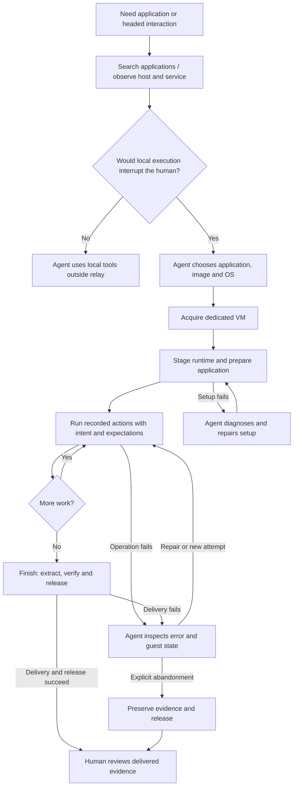

# UX Design: VM Discovery and Recorded Execution

| Item | Value |
|---|---|
| Document type | UX specification / agent interaction design |
| Status | Recovery, the guest-sharing console interface, and screenshot delivery are implemented with automated tests. Deployment and live acceptance remain separate; verification.md records operational status. |
| Audience | Agent/application authors, image maintainers, human evidence reviewers |
| Related documents | [Design overview](design.md), [technical design](technical-design.md), [verification](verification.md) |

## 1. Problem statement

An agent performing desktop or headed-browser work can interrupt the human using
that machine. It needs a discoverable way to select an appropriate disposable VM,
perform deliberate actions, deliver reviewable evidence and relinquish ownership.

Knowing an image exists is not enough to choose it. The agent needs to find an
installed application and compare its available operating systems. Application
inventories embedded in long instruction files make this unnecessarily difficult.
Conversely, an inventory alone does not explain unusual application launch or
operating procedures.

Execution intent helps reviewers understand a standalone evidence package.
Structured identifiers and state—not natural-language annotations—govern identity
and authorization.

## 2. Users and jobs to be done

| Actor | Job |
|---|---|
| Operating agent | Find an application/image, judge interruption, acquire an isolated environment, execute and deliver evidence |
| Parent agent or application | Compose a VM-use subagent through a prompt and receive bounded, verifiable results |
| Human or agent image maintainer | Provision applications, extract the installed inventory, and maintain naming aliases and operating guidance |
| Human reviewer | Understand what happened, what was expected, what evidence supports it and what remains unverified |

The agent chooses whether work is interruptive; the extension provides facts and
enforces ownership/execution guarantees. The extension does not spawn subagents
or execute non-interruptive work locally on the agent's behalf.

## 3. Goals and non-goals

### Goals

- One discoverable `relay` tool with explicit actions and concise results.
- Name-based application discovery with an optional OS filter, without acquiring
  a VM or asking for a natural-language justification.
- Let the agent choose between images and operating systems, not hide that choice
  behind an opaque best-fit score.
- Retain execution intent and observable expectations for review.
- Make incomplete discovery results, failed actions and unresolved cleanup visible.
- Keep application inventory separate from operating instructions.

### Non-goals for this revision

- Category taxonomy, semantic or fuzzy application matching.
- Caller-controlled result limits, pagination or cached search sessions.
- Automatic image selection, acquisition or software installation during search.
- Search does not introduce a verification badge or run acceptance tests. Image acceptance uses each application's test plan, while inventory extraction describes installed software.
- Local CUA execution, physical-machine targets, programmatic subagent spawning,
  CDP attachment or video recording by the extension.

## 4. Experience principles

1. **Discover without commitment.** Search/probe are read-only and can precede the
   routing decision. Neither requires a lease.
2. **Use structured data for choices.** Application version, image ID, OS and
   architecture are facts. No invented taxonomy or unexplained ranking score.
3. **Request intent where useful.** A recorded `run` includes human-readable
   execution intent alongside its action and expected result.
4. **Distinguish execution from proof.** A completed input, a verified package and
   human approval are different outcomes.
5. **Expose limitations honestly.** A truncated result is not exhaustive. A
   discovered image is not a capacity reservation. An error is not “no matches.”
6. **Keep setup conventional.** Install/update/remove through Pi's package manager,
   not an archive download or manual extraction workflow.

## 5. Primary user journey

This is a conceptual journey, not a mandated order of calls. Search may happen
before or after a capability probe. Staging and application setup remain necessary
before guest execution.



An application composes the enclosure by prompting a subagent, which then uses
`relay`. The parent application does not directly call vm-service or relay-driver.

## 6. Interaction model

### 6.1 Tool and command surface

Exactly one model-callable tool, `relay`, is registered. No legacy `relay_*` aliases
or extra search tool are introduced. Slash commands remain `/relay-status` and
`/relay-trajectory <package-directory>`.

**Action contract:**

| Action | User intent | `reason` |
|---|---|---|
| `search` | Find published images containing an application | Not allowed |
| `probe` | Observe the host and owned state by default, or request bounded executable readiness with scope=guest. | Not allowed |
| `acquisition-capabilities` | Read configured VNC availability without allocating or recovering ownership. | Not allowed |
| `acquire` | Obtain a fresh VM with declared outputs; optional vnc=true prepares sharing without opening a viewer. | Not allowed |
| `console-resolve` | Resolve console status for the owned lease and selected environment. | Not allowed |
| `console-open` | Open the standard service-host viewer following an explicit user request, with console_id, attempt_id, userRequested=true, and expected. | Required |
| `console-cancel` | Cancel the identified viewing attempt without releasing the VM. | Not allowed |
| `stage` | Prepare runtime, support files and optional browser/workspace | Not allowed |
| `run` | Perform one recorded operation with an optional execution timeout and report its outcome without automatic VM release. | Required |
| `image` | Retrieve one saved display image, declared application image, or immutable reference without input or directory export. | Not allowed |
| `extract` | Retrieve declared outputs | Not allowed |
| `finish` | Deliver verified evidence and close the enclosure | Not allowed |
| `release` | Abandon safely without claiming successful completion | Not allowed |

- Section 6.8 describes live viewing through these actions. `/relay-trajectory` remains an evidence-review command, not a live console. Console actions do not accept screenshot metadata or create screenshot evidence.

### 6.2 Application discovery

```json
{
  "action": "search",
  "name": "Firefox",
  "os": "linux"
}
```

`name` is required and nonblank. Matching is case-insensitive against canonical
names and maintained aliases: exact, then prefix, then substring. There is no
semantic substitution; Chromium must not match Firefox just because both are
browsers.

`os` is an optional hard filter (`linux` or `macos`). Omit it to compare platforms;
there is no implicit OS preference. ARM Linux is `linux` plus `arm64`, not another
OS family. Architecture is returned, not a first-version search filter.

The result groups installations under each application. This example is
illustrative and assumes `os` was omitted, not the Linux-only request above:

```json
{
  "applications": [
    {
      "name": "Firefox",
      "installations": [
        {
          "image": "ubuntu-desktop",
          "version": "128.0",
          "os": "linux",
          "architecture": "arm64"
        },
        {
          "image": "macos-desktop",
          "version": "128.0",
          "os": "macos",
          "architecture": "arm64"
        }
      ]
    }
  ],
  "truncated": false
}
```

The agent can pass `image` directly to `acquire`. Versions describe installed
software, not verification levels. There are no verification, instructions,
category or ranking-score fields.

### 6.3 Execution intent

```json
{
  "action": "run",
  "reason": "Confirm the dialog on the isolated desktop.",
  "kind": "browser",
  "browser": { "action": "click", "selector": "#confirm" },
  "step": {
    "id": "confirm-dialog",
    "title": "Confirm the dialog",
    "expected": "A confirmation appears.",
    "inputMode": "ordinary"
  },
  "snapshots": { "afterIntervalMs": 500 }
}
```

`reason` explains execution intent for a reader outside the original conversation.
`step.title` describes the action; `step.expected` states the intended visible
result. Structured step/request/execution identifiers provide identity. Natural
language must never be used for deduplication, authorization or retry decisions.

The agent declares the after-snapshot interval based on the action's semantics.
The tool does not invent a default wait or silently substitute stability detection.

### 6.4 Recovery after a failed operation

- A failed command does not mean that the VM has stopped or been released. The agent can inspect the error, fix the environment, and issue another command in the same VM.
- A timeout ends the current operation according to the timeout contract. It does not end the VM lifecycle.
- A response states the outcome, available stdout and stderr, diagnostic details, evidence location, and actual lease state. A failed staging response must be as clear about VM ownership as a failed execution response.
- The agent decides whether to repair, submit a new attempt, extract evidence, finish, or release. The tool does not automatically repeat failed or uncertain operations.
- If the outcome is uncertain, the response explains what is unknown. The agent can inspect current state before deciding whether another attempt is appropriate.
- The system must not permanently reject later calls merely because an earlier call failed. An individual call can still be rejected for invalid arguments, missing authorization, or unmet current-operation requirements.
- Earlier failures remain visible in the evidence even if a later attempt succeeds. Recovery must not change historical outcomes.
- Lifecycle state belongs to the tool's state machine rather than the conversation. After context compaction, the agent can inspect current state and continue valid work without remembering every earlier command.
- Successful `finish` and explicit `release` end the VM lifecycle. A delivery failure leaves the VM available.
- Agent completion, session shutdown, or session replacement does not release the VM. Once the session stops actively using it, lease renewal stops and the last confirmed expiration time is reported. On reload or resume, the tool reconciles persisted ownership before continuing without replay.

### 6.5 Execution timeout

- The agent may supply `run.timeoutMs` when an operation needs a different execution limit, such as a browser download.
- The default execution timeout is 120,000 ms, and callers may supply a positive integer up to 3,600,000 ms. The effective limit is reported on timeout.
- The execution timeout, screenshot delay, and lease lifetime are independent settings. Changing `snapshots.afterIntervalMs` does not extend a command's runtime.
- The timed-out operation is not automatically replayed. The agent can inspect and recover the same VM.

### 6.6 Host observations and guest readiness

- The existing `probe` action reports host activity and VM-service availability. It can run before a guest exists and does not verify software inside a guest.
- Host idle time is supporting information, not proof that desktop interaction will not interrupt the user. Missing observations are reported as unknown.
- Guest readiness checks must be clearly distinguished from host observations in their interface and results.
- Guest checks verify prerequisites and report errors without silently installing software or replacing image acceptance tests.

### 6.7 Image maintenance and application test plans

- Maintainers find the application inventory at `images/<image>/applications.json` in the image repository.
- Each application deliberately added by provisioning uses a shared baseline for availability and launch. Most need configuration only. Unchanged OS software is not automatically selected, even when it appears in the application catalog.
- An application with special requirements has its own additional checks under `applications/<application-id>/`. Those extensions do not change the shared baseline or other applications' tests and cannot replace required baseline checks.
- Plans describe prerequisites, steps, expected results, evidence, and failure conditions. Reports distinguish baseline outcomes from application-specific extension outcomes.
- Image acceptance runs the applicable plans on a fresh clone through vm-service's actual execution environment. A test must not hide a missing executable path by initializing a shell environment that relay does not use.
- Required selected tests pass before promotion. The report identifies catalog entries outside application-test scope as not tested, not passed. Missing selected executables or failed selected checks still fail acceptance.
- Checks of image settings we changed, and no-secrets checks, remain mandatory; application scope does not remove them.
- Search reads installed facts and does not execute those tests or imply that every project-specific dependency is available.

### 6.8 Live viewing of the owned VM

- [The console consumer contract](console.md) provides the implemented invocation sequence and backend dependency boundary. The backend uses unmodified Tart and owns guest sharing, transport, and standard viewer launch; relay does not launch its own viewer or expose credentials.
- Users must explicitly request viewing. Relay prepares sharing only when acquisition requests `vnc: true`, and a separate `console-open` opens the standard viewer on the service host. Console-cancel never releases the VM.
- Process launch, transport, authentication, pixels, and human confirmation remain separate. The implementation has mocked tests, not a live viewing or human acceptance pass.

- A human observer needs to watch the same guest desktop that the operating agent uses. This is a different job from reviewing retained evidence after execution.
- Discovery is read-only and must not open a local window. Opening the viewer is an intentional interruption of the user's desktop and requires an explicit user request.
- Viewing support must not open a second guest desktop, browser, or VM. The observer must see the actual session used by the agent and relay capture.
- Linux shares the existing X11 desktop through x11vnc inetd and a TurboVNC viewer with server-enforced view-only access. macOS uses Apple's Screen Sharing and human guest-account authentication. The human must choose Standard sharing of the existing console, not a new Log In session or High Performance display. macOS reports unverified viewer session selection and no server-enforced view-only guarantee.
- Opening is an intentional interruption on the service host, which may not be the relay client's machine. A configuration-capability response does not prove live guest readiness. [Verification](verification.md#console-rollout-status) separates component evidence, rollout observations, and remaining acceptance.

#### Required-viewing flow

1. The consumer calls `acquisition-capabilities`, selects an available OS/image, and acquires through relay with `vnc: true` and declared extractions. Omission or false keeps ordinary acquisition; an existing non-VNC lease cannot be retrofitted automatically. Necessary runtime setup must not begin the requested guest application work.
2. The consumer calls `console-resolve` for the owned lease and uses the returned `console_id`, not a guessed endpoint or VM selector.
3. Following the user's explicit request, the consumer calls `console-open` with that `console_id`, a new `attempt_id`, `userRequested: true`, a nonblank `reason`, and a nonblank `expected`. Relay revalidates ownership and target identity before asking the backend to open the standard service-host viewer. The intent declaration is not independently verified authorization.
4. The consumer checks the reported connection evidence and obtains human confirmation when necessary. An accepted launch request alone is insufficient to establish viewing.
5. Once required viewing is established, the consumer starts guest application work. The agent continues to inspect relay snapshots rather than rely on the human viewer as its own visual input.
6. The consumer finishes or releases through relay. Closing the viewer does not destroy the lease, and leaving a viewer window open does not prevent verified VM destruction.

#### Readiness and failure presentation

- Discovery reports whether support is available, unsupported, temporarily unavailable, or indeterminate. It separately reports whether an authoritative target was resolved for the current lease.
- Top-level console `status: ready` means guest preflight, not successful viewing. The nested `attempt.status` describes launch progress separately. Transport connection, authentication mechanism and status, viewer connection, pixels, and human confirmation remain independent; missing observations remain unknown. A launched process or RFB banner must not upgrade later stages.
- After uncertain opening, resolve or explicitly cancel the same attempt. Duplicate opens do not replay launch. `console-cancel` closes managed resources without releasing the VM or changing renewal policy; a new attempt requires reconciliation of the previous one.
- Unsupported backends, unresolved capability, missing viewer applications, authentication failures, expired leases, and stale targets produce distinct explanations and actionable next steps. Relay must not silently select another VM or invent a fallback endpoint.
- If required viewing cannot be established, the consumer reports the blocker and stops before guest application work. The VM remains subject to the normal recovery and explicit-release rules; a viewer failure does not automatically destroy it.
- A harmless guest display change must be compared in the human viewer and relay capture during acceptance. Human confirmation is recorded separately from machine observations and does not constitute approval of the agent's work.
- If the viewer works but relay images are black or unavailable, the consumer reports the capture failure separately. The agent must not proceed blindly merely because the human can watch.
- Ordinary sessions without a viewer request remain unchanged. Neither acquisition nor probe opens a host window automatically.

### 6.9 Screenshot delivery and recovery

- The [screenshot-delivery specification](screenshot-delivery.md) defines the implemented worktree interaction. The thirteen-action schema includes `image` and the console actions; this does not establish that an installed plugin has loaded this revision.
- After an operation with a saved after-capture, the agent receives the correctly associated display image in the final result. Execution outcome and image-delivery outcome remain separate.
- First and intermediate text-group events do not receive an invented after-image. Diagnostic commands remain explicitly without visual evidence.
- If inline delivery is unavailable, the agent retrieves the same saved image through its authorized reference. Recovery does not repeat a click, scroll, capture, consumer-directory export, or acquisition.
- An application screenshot is selected through its extraction declaration and identified separately from the display image. Neither image can silently substitute for the other.
- Results distinguish capture failure, unknown capture status, missing files, unauthorized or stale references, unsafe paths, integrity failures, transfer failure, and unavailable presentation. A path or encoded string is not an inspected image.
- Each delivery or retrieval has a total 90-second deadline and one shared budget of three byte-transfer attempts, including metadata transfers. Verified local recovery needs no guest transfer. At most two explicit reference-recovery calls are recommended, further limited by the application's remaining budget.
- When recovery is exhausted, the agent stops exploratory input and finalizes or abandons under the application's policy. A human live viewer does not remove this requirement.
- An attached image proves only that Relay returned typed image content. Provider acceptance, agent inspection, and human review are reported separately.
- Display selection is `{action:"image", target:{source:"display", sessionId, executionId, phase:"before"|"after"}}`. Application selection is `{action:"image", target:{source:"application", name, path?}}`; a declared directory requires one relative image path, while a declared file omits it. Reference selection is `{action:"image", target:{source:"reference", imageId}}`, using the returned `image-` reference with 64 lowercase hexadecimal digits. All selectors are closed and reject caller-supplied owner, VM, or backend fields.
- Originals are limited to 64 MiB, 40,000,000 decoded pixels, and 32,768 pixels per dimension. Previews are limited to 2,000 × 2,000 pixels and 4 MiB of base64-encoded data. JSON/journal metadata is bounded to 4 MiB per file; a file path alone does not bypass these limits.
- Recovery checks the owner's retained recording lineages and verified local originals before requiring a reachable guest. Closed or sealed enclosures return `stale-reference`, while already delivered originals remain readable through host tools.
- Pi's public `resizeImage` helper prepares previews without changing archived originals. Real Pi SDK 0.85.1 tests verify image-bearing errors and `images.blockImages`; offline adapter tests verify non-vision placeholders. These checks do not establish acceptance by the exact affected gateway.

## 7. Empty, partial and failure states

| State | Required experience |
|---|---|
| No matches | `{"applications":[],"truncated":false}`; no implied backend failure |
| Incomplete matches | Return valid complete records with `truncated:true`; do not imply the list is exhaustive |
| Catalog unavailable/malformed | Return an explicit error rather than no matches, and identify missing inventory or association paths. |
| Invalid request | Reject before lease or guest effects; no silent fallback action |
| Image acquisition unavailable | Report the normal acquisition failure; search did not reserve capacity |
| Setup or command failure | Preserve the VM and allow the agent to inspect, repair, and submit another operation. |
| Execution refused/uncertain | Preserve the distinction and evidence, retain the VM, and allow agent-directed recovery without automatic replay. |
| Command timeout | State the effective limit, termination status, available output, and actual VM state. |
| Finish delivery failure | Retain the VM and evidence so the agent can investigate or retry delivery. |
| Cleanup unresolved | Retain ownership and report the problem rather than claiming release |
| Evidence delivered | Report delivery, snapshots, execution and human review separately |

- Search has no continuation mechanism, and this revision does not introduce pagination.
- Retain `truncated` in diagnostics so maintainers can check it against actual omitted records. Unexpected behavior is a correctness issue in the existing implementation.

## 8. Discoverability and presentation

- The tool description and Pi Available tools `promptSnippet` explain all actions,
  including discovery inputs and execution intent.
- `before_agent_start` guidance retains the interruption/routing doctrine without
  suggesting that search itself is interruptive.
- Call headers identify the action, e.g. **Relay · Search**, **Relay · Acquire**,
  **Relay · Run**, despite sharing one tool name.
- Keep results bounded and structured; a generic output spill file is not a
  substitute for a correctly capped search response with `truncated`.
- Existing viewer commands remain available. Lifecycle hooks must be reviewed against the new recovery requirements rather than preserved unchanged.
- Human review remains pending until the human supplies it.

## 9. UX acceptance criteria

- An agent can express a name search without unnecessary fields, compare platforms
  and select an explicit image without a lease being created during discovery.
- OS filtering is predictable; exact/alias hits are deduplicated and ordered
  deterministically without an exposed score.
- Empty results, backend failures and incomplete results are distinguishable.
- Execution intent is clear; examples and model guidance conform to the documented
  fields for each action.
- Operating guidance is not confused with software inventory or proof of
  verification.
- Real Pi registration/startup/reload tests verify discoverability, schema and
  action presentation. Historical execution trajectories do not prove new search UX.

- An agent can recover from a failed operation in the same VM without automatic release or a permanent failure flag blocking later calls.
- A timeout result identifies the effective limit and does not imply VM destruction.
- Host observations are clearly distinguished from guest readiness and image acceptance results.
- An application test failure is visible to the image maintainer and prevents promotion when that application is required.
- A baseline-only application does not need a custom executable test suite. Adding a special application's extension leaves other applications' effective test plans unchanged.

### Live-viewing acceptance (pending live verification)

- A human can request live viewing and observe the owned VM before guest application work begins, without needing backend commands or credentials from the agent.
- Responses make launch, connection, correct-display confirmation, and human review visibly distinct.
- Required-viewing failures stop the consumer before browsing and identify the actual blocker without claiming successful viewing.
- The viewer remains usable during relay operations, and normal lease cleanup remains effective regardless of whether the viewer window is open.
- The engineering checks in [Technical design Section 3.8](technical-design.md#38-live-viewing-of-the-owned-vm) must pass before live-view support is reported as verified.

### Screenshot-delivery acceptance

- Implementation and automated coverage are complete in this worktree, but the live acceptance criteria below remain requirements rather than completed model/VM acceptance claims.
- The pre-merge screenshot-delivery `npm test` run contains 438 tests: 435 passed, two failed, and one was skipped. The failures require missing historical `test-evidence/ubuntu-20260912-2127` and sibling `pilot-images/inventory/collect.py` fixtures. Build, typecheck, RPC smoke, and clean-install checks passed. These results do not mean all gates passed.

- A controlled multi-step session delivers inspectable, correctly associated after-images without intermediate consumer-directory exports.
- Recovery returns the same original without another input or capture, and exact application-image retrieval respects the acquisition-time declarations.
- Failed operations retain their execution outcome while presenting available evidence. Incomplete groups and unavailable presentation remain explicit.
- The successful workflow exports the consumer directory only at finalization. The worktree uses UUID full-workspace destinations for retries and merges verified display originals into canonical package snapshot paths without overwriting conflicting evidence.
- The release report identifies the loaded Relay revision and verified host adapter. Offline serialization, actual agent inspection, and human review are not interchangeable claims.

## 10. Related documents

- [The implementation plan](../.plans/2026-09-16-10-51-agent-recovery-and-image-readiness.md) tracks unresolved implementation decisions within this revision's scope.
- [The technical design](technical-design.md) defines the agreed contracts, invariants, and acceptance requirements.
- [Implementation verification](verification.md) distinguishes worktree implementation, automated checks, historical acceptance, and deployment rather than treating design intent as shipped behavior.
- [Screenshot delivery](screenshot-delivery.md) defines the implemented worktree image-result, authorization, recovery, and presentation contract. Its [implementation plan](../.plans/2026-09-21-screenshot-delivery.md) preserves the original proposal and diagnosis alongside remaining verification work.
